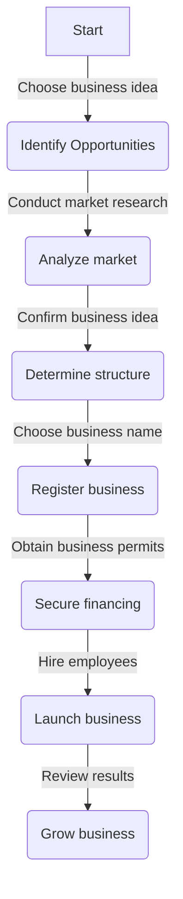

### 为了测试chatGPT的代码能力，我让GPT输出Diagrams（一个免费开源作图程序，可以做图表公式等）的流程图

# Creating a company flowchart

Hello! How can I assist you today?

## Write a flowchart in Markdown format that supports Diagrams, describing the steps to create a company

Sure, here's a flowchart in Markdown format for creating a company:




```md
```mermaid
graph TD;
    Start[Start] -- Choose business idea --> Identify(Identify Opportunities);
    Identify -- Conduct market research --> Analyze(Analyze market);
    Analyze -- Confirm business idea --> Determine(Determine structure);
    Determine -- Choose business name --> Register(Register business);
    Register -- Obtain business permits --> Secure(Secure financing);
    Secure -- Hire employees --> Launch(Launch business);
    Launch -- Review results --> Grow(Grow business);
这里有```符号，请忽略中文
``` 


This flowchart depicts the steps for creating a company, including choosing a business idea, conducting market research, determining business structure, registering the business, securing financing, hiring employees, launching the business, and growing the business.

## 用markdown格式写Diagrams支持的流程图，讲述制作鱼香肉丝的步骤

Sure! Here's a Markdown flowchart using the Diagrams syntax to outline the steps for making Fish Fragrant Pork:


```{dot}
digraph fish_fragrant_pork {
  Start[label="Start Cooking"];
  Chop[label="Chop pork and vegetables"];
  Season[label="Season pork with salt, pepper, soy sauce, and cornstarch"];
  Fry[label="Fry pork until golden and crispy"];
  SetAside[label="Set pork aside"];
  FryVeggies[label="Stir-fry vegetables"];
  AddSauce[label="Mix together sauce ingredients and add to vegetables"];
  AddPork[label="Add pork back to the pan"];
  Serve[label="Serve with rice and enjoy!"];

  Start -> Chop -> Season -> Fry -> SetAside;
  FryVeggies -> AddSauce -> AddPork -> Serve;
}
``` 

```md
```{dot}
digraph fish_fragrant_pork {
  Start[label="Start Cooking"];
  Chop[label="Chop pork and vegetables"];
  Season[label="Season pork with salt, pepper, soy sauce, and cornstarch"];
  Fry[label="Fry pork until golden and crispy"];
  SetAside[label="Set pork aside"];
  FryVeggies[label="Stir-fry vegetables"];
  AddSauce[label="Mix together sauce ingredients and add to vegetables"];
  AddPork[label="Add pork back to the pan"];
  Serve[label="Serve with rice and enjoy!"];

  Start -> Chop -> Season -> Fry -> SetAside;
  FryVeggies -> AddSauce -> AddPork -> Serve;
}
这里有```符号，请忽略中文
```

This flowchart outlines the steps for making Fish Fragrant Pork, including chopping the pork and vegetables, seasoning the pork, frying it until golden and crispy, setting it aside, stir-frying the vegetables, mixing together a sauce and adding it to the veggies, adding the pork back to the pan, and finally serving with rice.

## 用markdown格式写Diagrams支持的流程图，讲述制作宫保鸡丁的步骤

好的，这是一个用Diagrams语法的Markdown流程图，用于描述制作宫保鸡丁的步骤：


```{dot}
digraph kung_pao_chicken {
  Start[label="开始"];
  Chop[label="切鸡肉和蔬菜"];
  Marinate[label="用盐，胡椒粉和生粉腌制鸡肉"];
  Fry[label="炸鸡肉至金黄色和脆"];
  SetAside[label="把鸡肉放在一边"];
  FryVeggies[label="炒香葱、姜和蒜"];
  AddPeppers[label="加入青椒和红椒"];
  AddSauce[label="混合酱料并加入青红椒"];
  FryWithCashews[label="加入腰果炒熟"];
  AddChicken[label="把鸡肉放回去"];
  Serve[label="用米饭搭配享受！"];

  Start -> Chop -> Marinate -> Fry -> SetAside;
  FryVeggies -> AddPeppers -> AddSauce -> FryWithCashews -> AddChicken -> Serve;
}
``` 

```md
```{dot}
digraph kung_pao_chicken {
  Start[label="开始"];
  Chop[label="切鸡肉和蔬菜"];
  Marinate[label="用盐，胡椒粉和生粉腌制鸡肉"];
  Fry[label="炸鸡肉至金黄色和脆"];
  SetAside[label="把鸡肉放在一边"];
  FryVeggies[label="炒香葱、姜和蒜"];
  AddPeppers[label="加入青椒和红椒"];
  AddSauce[label="混合酱料并加入青红椒"];
  FryWithCashews[label="加入腰果炒熟"];
  AddChicken[label="把鸡肉放回去"];
  Serve[label="用米饭搭配享受！"];

  Start -> Chop -> Marinate -> Fry -> SetAside;
  FryVeggies -> AddPeppers -> AddSauce -> FryWithCashews -> AddChicken -> Serve;
}
这里有```符号，请忽略中文
```

这个流程图描述了制作宫保鸡丁的步骤，包括切鸡肉和蔬菜，用盐、胡椒粉和生粉腌制鸡肉，炸成金黄色和脆的鸡肉，炒香葱、姜和大蒜，加入青椒和红椒，混合酱料并加入青红椒，加入腰果炒熟，最后把鸡肉放回去，在米饭上享受！