**Ctrl+W**：版图软件里的Alt+F4，一键快乐

**U**：Undo，撤回

**Esc**：退出

经验来讲，不小心按错了进入了什么古怪的状态的时候，按Esc要是还不起作用，应该就是按Shift+B了（这里指不小心按到X键，进入更深一层的模块编辑模式，让当前页面中大部分内容无法编辑，看起来就像是卡死了一样）

旁边的**~**按钮，这个键没用

旁边的**F1**是帮助页面

**F2**：保存

**F3**：所有进行中的绘画动作的设置界面

**F4**：当你处在一个有选项的界面（比如F3）时，试一下就知道了

**Delete**：删除

既可以选中目标再按Delete，也可以先按Delete进入删除模式，鼠标左键使用，哪里不爽点哪里

**Backspace**：回退

容易被忽略的一个按钮，当你的操作需要多次点击的时候（例如P或者Shift+P这样需要弯折多次的过程），如果错了一次，点它，就不用全盘重来了

**Shift**：按住Shift不动，鼠标左键可多选

**↑↓←→**：很直白，上下左右

这里要注意视角的移动问题，一共有三种方法移动你的视角，分别是，按住鼠标中键拖动、滚轮放大缩小配合鼠标移动改变视角、键盘上下左右。你永远可以相信键盘的上下左右移动视角，因为有些时候前两种方法会失效。

熟练地掌握视角移动，尽情地放大缩小，能提高画图精准度和速度

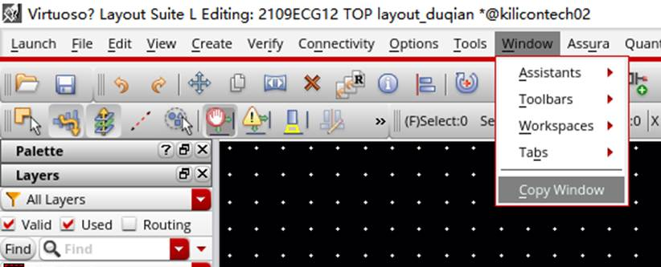

图 1 还可以通过双屏的方式同时拥有两个视角，这两个视角是实时同步的

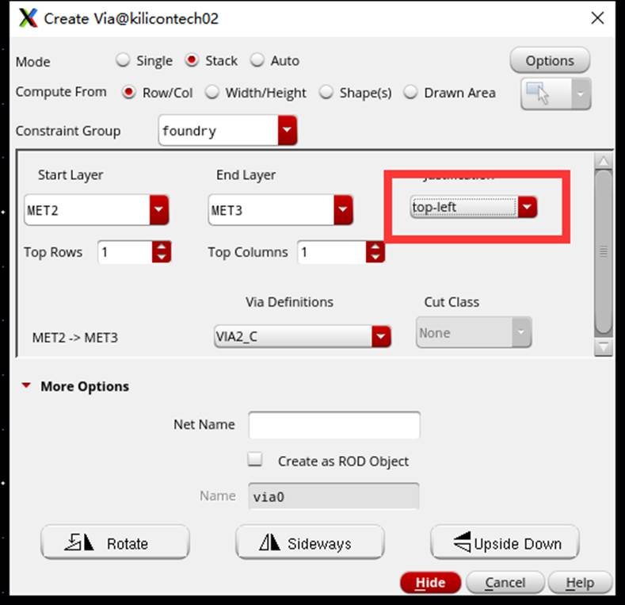

图 2 方向键可以快速改变选项，比如这里的选项被虚线拟选中，按方向键就可以调整

**Q**：已选定目标的详细信息

可以更改这些信息来改变已绘制的图案，例如pmos更改为nmos

该界面左侧可以按住ctrl或者shift进行多选，使右侧操作同时对多目标生效

此界面本质上一直存在，所以如果Q页面单纯被别的页面覆盖（即，没有关闭Q的页面而转移到其他页面上去，导致Q窗口看不见），再次按Q不会有反应，因为Q页面已经被打开，此时应该按下Esc关闭被隐藏的Q页面，再重新按Q

在电路图中，已选定器件的详细信息也是按Q来呈现

电路图中对某器件按Q，会使该器件信息被临时记住，此时转向版图页面，在版图中按I新建器件，若新建器件的种类和电路图中被记住的器件种类一致，则会自动填写器件详细信息

Shift+Q可以打开一个空白的属性页面，具体作用未知

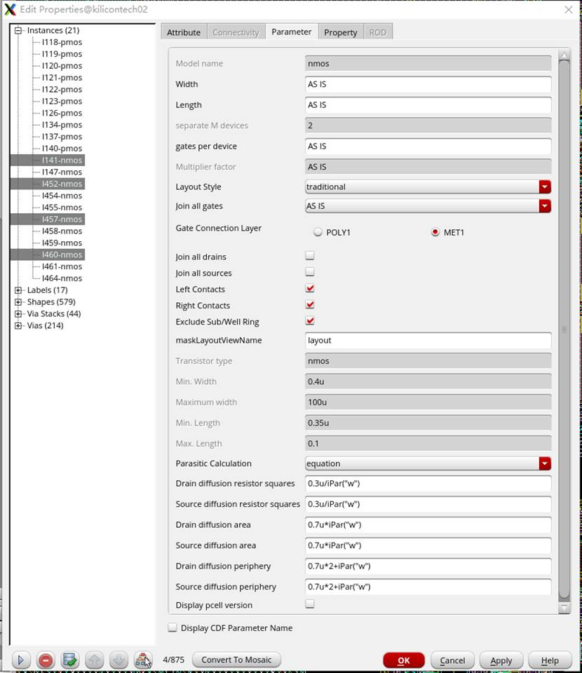

图 3按下Q之后的详细页面，该页面信息可以编辑，以应用改变到器件上

**P**：画线，即绘制最基础的连接线

绘制过程中无法切换线材

按下N，解锁45°倾斜的直线

按下ctrl+N可以直接绘制折线，这一点非常重要，几乎所有折线都能用上

绘制折线时，鼠标中键可以改变弯折的方向（Snap Mode）

连线基本规则是1、3横，2、4竖。有时候模块旋转之后会反过来，没关系，模块之间可以不强求统一，但单个模块内部要统一

尽量用层数低的金属，给后面的连线“留退路”

一条线画完之后按空格可以弹出一个打通孔的界面，但是似乎只能打单孔，单孔通孔是不推荐的

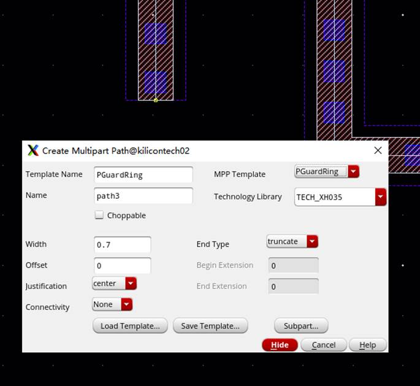

图 4 Create→Multipart Path→F3可以选择像画金属线一样画Guard Ring（此功能默认没有快捷键）

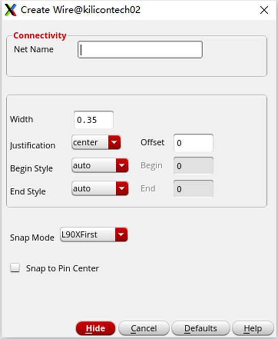

图 5按下P之后再按下F3即可看到该页面，主要功能有修改线宽、改变线头线尾的形状和自动连接到通孔中央（Snap to Pin Center）

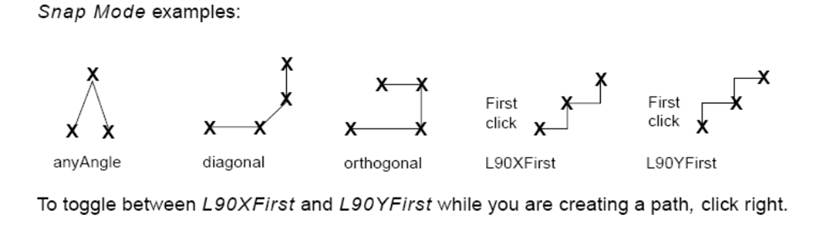

图 6 改变snap model，N→diagonal, Shift+N→orthogonal, Ctrl+N→L90Xfirst（鼠标中键切换XFirst模式和YFirst模式）

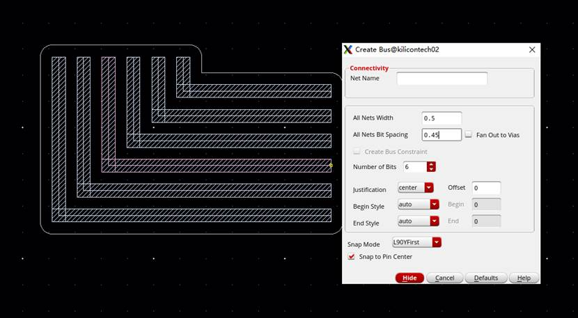

图 7 Ctrl+Shift+X可以同时绘制多条线，这一功能配合Ctrl+N会更加有用

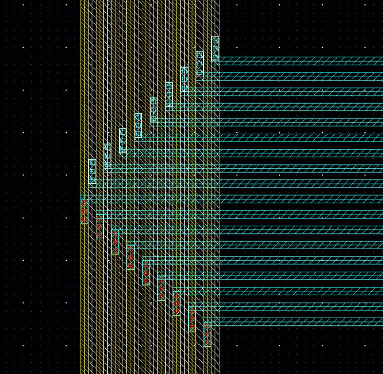

图 8 一种Ctrl+Shift+X的布线应用

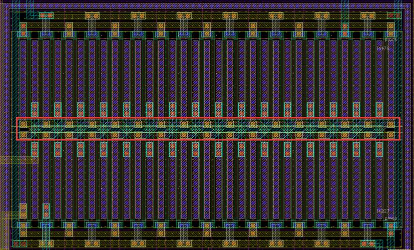

图 9 这是一种两mos管匹配的布局，中间的连线是螺旋状的。这种麻花一样的螺旋结构还有很多例子，耳机线、铜网线等 ，可以在网络上搜索“双绞线”。虽然版图中这里可能只是长得和“双绞线”相似，但是核心思路有一定共通性——如果避免不了干扰，那就尽可能让它们受到相同的干扰

**I**：建造，既可以建造元器件，也可以建造某个组合好的模块

注意，建造的器件之间，下图三个警示按钮不生效，因为此时软件将建造物视作“某种被搅拌均匀的物质”，所以甚至能将两个模块重合，而不会实时报错

该实时报错只针对当前页面下绘制的图案（也就是引用出来的图案不进行检测）

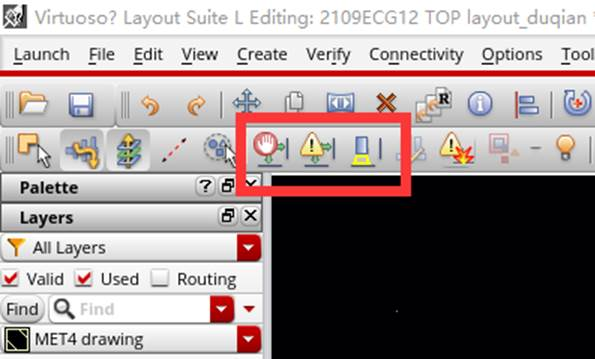

图 10三个实时报错按钮，分别是阻止错误行为、提醒错误行为、已绘错误图的标记

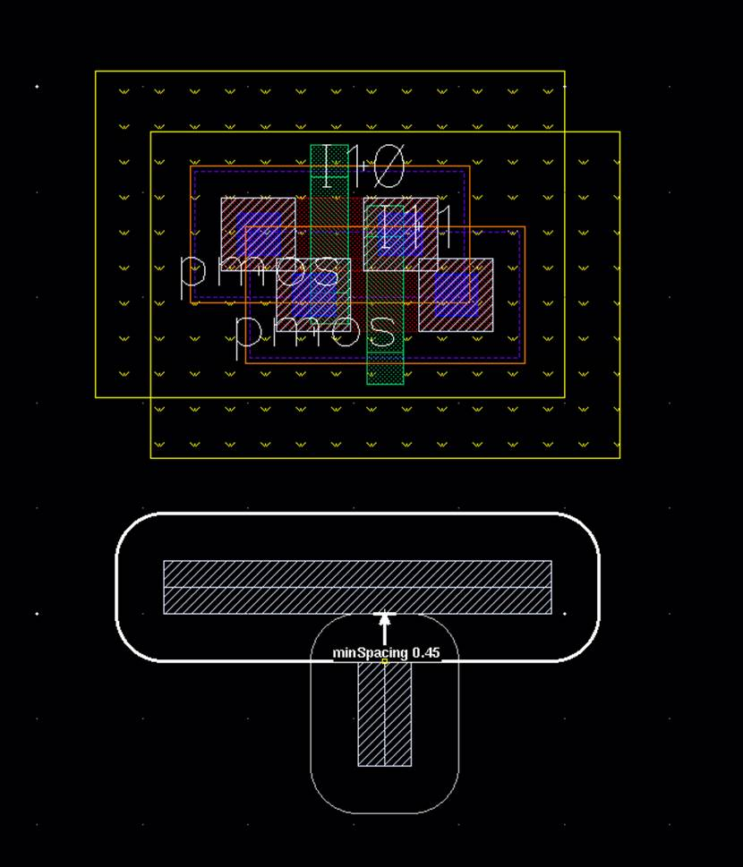

图 11建造时不会实时报错，绘画时才会提醒错误

**pmos****与****nmos**：

 

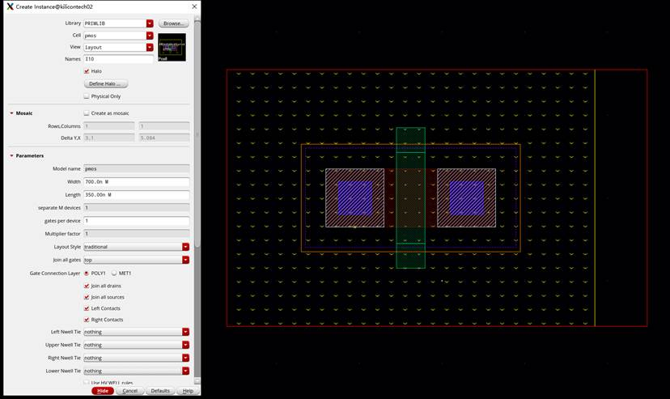

图 12建造pmos时的界面

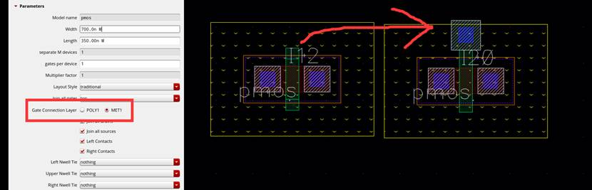

图 13栅极可选择性添加连接点，此处工艺还可两侧选择添加在上方、下方或者上下同时添加连接点，但是两侧同时添加连接点时务必谨慎，因为栅极两侧同时添加连接点有可能误把poly层当作导线使用

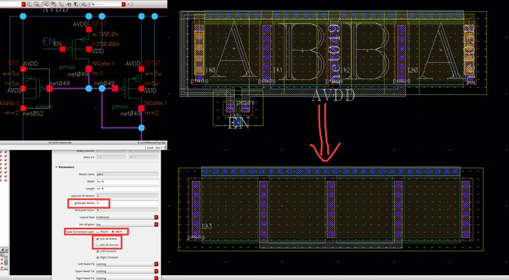

图 14图中上侧为四个相同pmos组合绘制而成，而下侧则是调整“gates per device=4”来一次性生成的4合1器件。当绘画组合mos器件的时候，可以通过调整设置，在建造器件的时候完成大概步骤，就不用一个器件一个器件对齐、连线等操作了

**R**：绘画矩形，与P一样常用，很多时候比P更加方便

绘制过程中可以切换不同材料

选中已绘制的图案，按下Shift+C即可再绘制一个矩形区域并将其剪切掉（cut）

Shift+P可以通过描边的形式绘画任意直边图形

有画圆的按钮，但没必要知道

图 15 如果按下Shift+P之后不能画斜线，那就按下Shift+P之后再按下N键。不过像上图这样的锐角图案，无论走到哪都让人高兴不起来

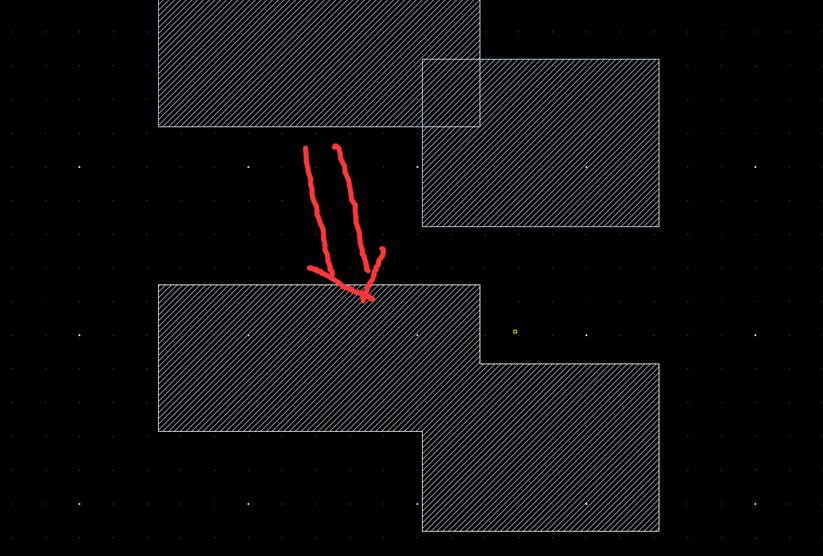

图 16 Shift+M可以将不同的图形整合成一块，整合之后有一定的好处，但是，这个操作不可逆

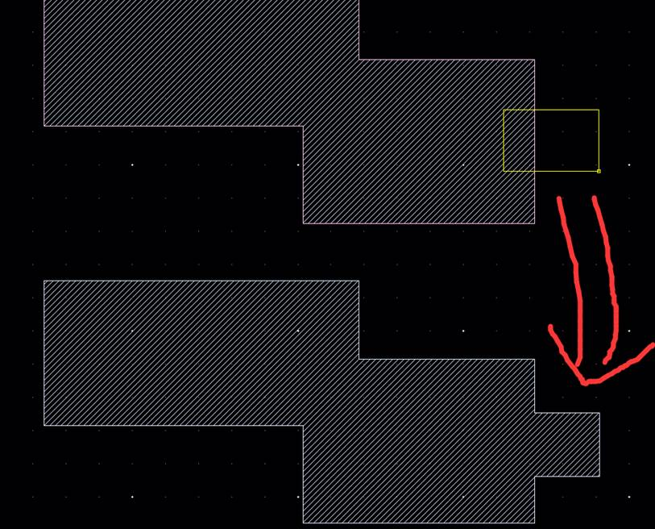

图 17 Shift+R可以在已有图案上补一块图案，这个功能不常用，因为我们可以用Shift+M来更加自由地实现这个功能

**S**：已选定目标时等同于M（移动），无目标锁定时按下S可选择仅调整某图案的一条边

S的功能很多，可以替代M（移动），可以调整图案的大小，不过操作逻辑不太符合直觉，需要熟练

这个调整的功能可以对Guard Ring使用

Shift+S是查找功能，初学可以不理会这个，但是必学，拉取别人的版图的时候可以快速的知道图中的接口在哪

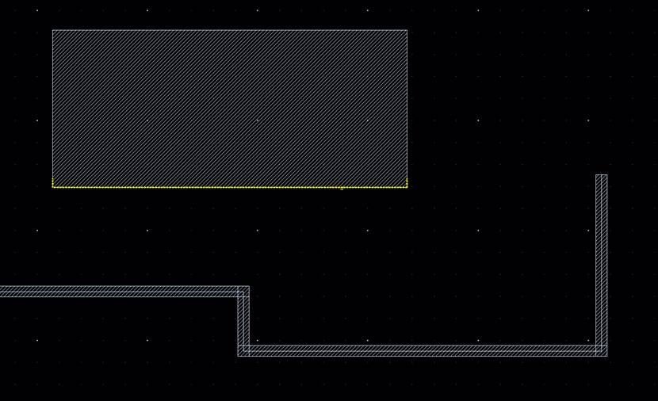

图 18 S的使用需要先放空鼠标，不要选择任何东西，这一点可以通过点击空白区域（或Ctrl+D，取消选择）和Esc（或Ctrl+C，中断命令）来实现，再按下S，然后鼠标移动到某一端去。放空这一点很常用，如果鼠标配有侧键，可以设置一个按钮为“鼠标放空键”，将其设置成“Ctrl+C再Ctrl+D”

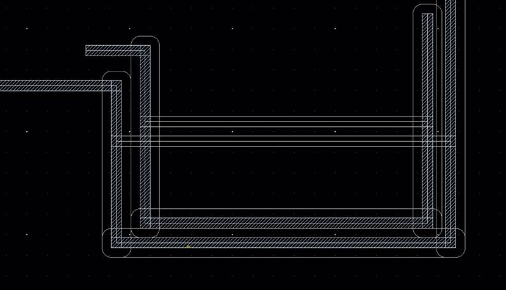

图 19 可以批量向同一方向调整，操作逻辑是：放空鼠标，按下S，左键按住不动拉出矩形框去框选，松开左键，再左键单点

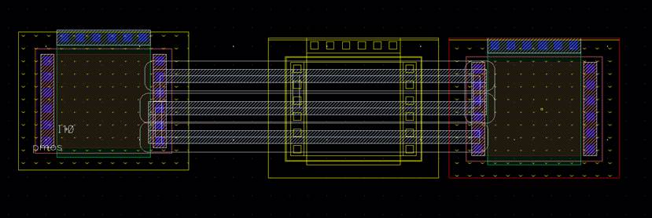

图 20 S最精髓的地方在于，可以保持连接关系的情况下移动已选定目标。如上图，移动时，金属线会跟着自动延长

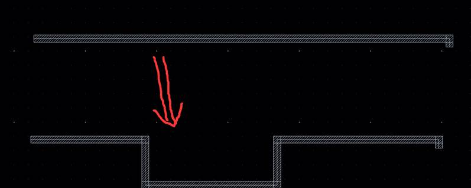

图 21 上图功能可以使用快捷键Ctrl+S来完成，划出需要改变的区域之后请双击左键来表示确定。注意，它的逻辑是：第一次穿过被编辑图案的划线，的穿过方向，的左侧，在双击鼠标之后可以调整；的右侧，是固定不动的区域——文字难以理解，但可以实际尝试一下，这个技巧很重要，而且同样可以对Guard Ring生效

**A**：对齐

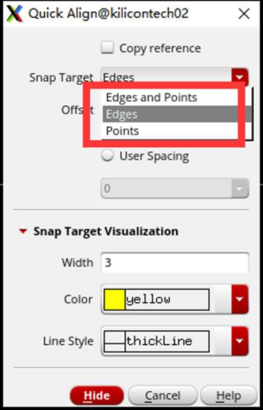

图 22 有时候会不小心更改掉这个选项，如果A不好用了，可以看下是不是这里设置出错，一般选择Edges

**C**：复制

大批量工作的神器

复制的选项设置在本质上一直存在，且自动保存，不会刷新

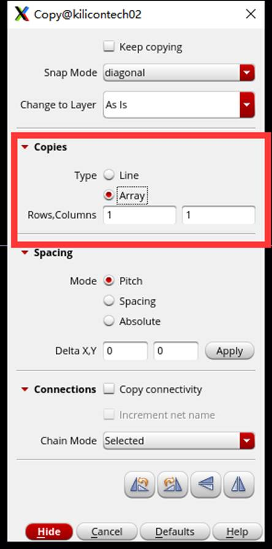

图 23 这里可以选择复制一排或者复制一个矩阵出来，但是基于复制的选项设置不会在每次使用时刷新，所以可以采取这个方法来切换单个复制和批量复制的模式：Line保持数值为1，用来进行直观的常规的拖动复制；Array用来批量复制，因为Array完全可以完成Line的工作，所以完全没有损失

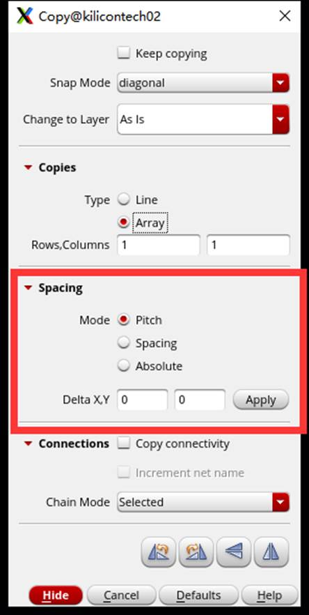

图 24 这里正是大规模复制的关键点，在上面选好复制数量之后，这里应该设置：每多少距离复制一个（Pitch）、每间隔多少复制一个（Spacing），第三个选项Absolute不常用

**7**：将与选中点相连的所有导线都标记出来

Shift+7可以取消所有标记

7对复制、移动、删除等都无响应

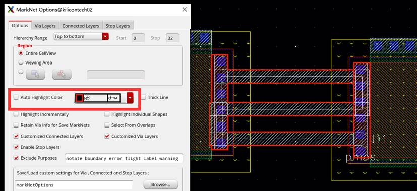

图 25 默认情况下，每次标记都会给出不同的颜色，但是也可以自己选定颜色进行标记，因为有些标记颜色和layout中的颜色很相近，可能会看不清

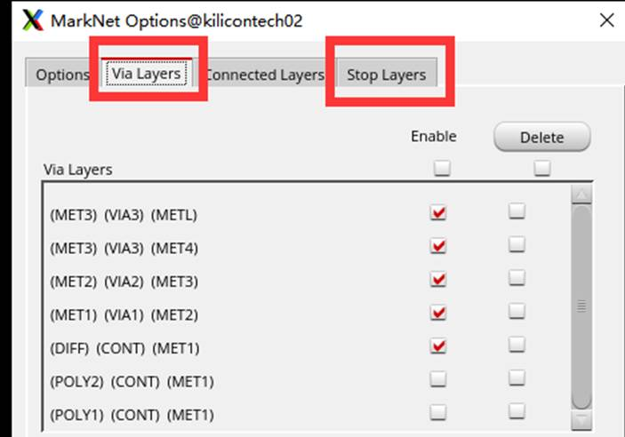

图 26 当发现7的标记功能出问题时，可以检查一下这两处的设置。如果设置不当，标记后看起来就像是短路或者断路

**K**：标尺，尺子

常常配合R、P、A等使用，可当作绘图草稿或者对齐标准线

K可以用Delete逐个删除，可被复制、移动，且不会变形——尺子的数值会跟随移动而变化

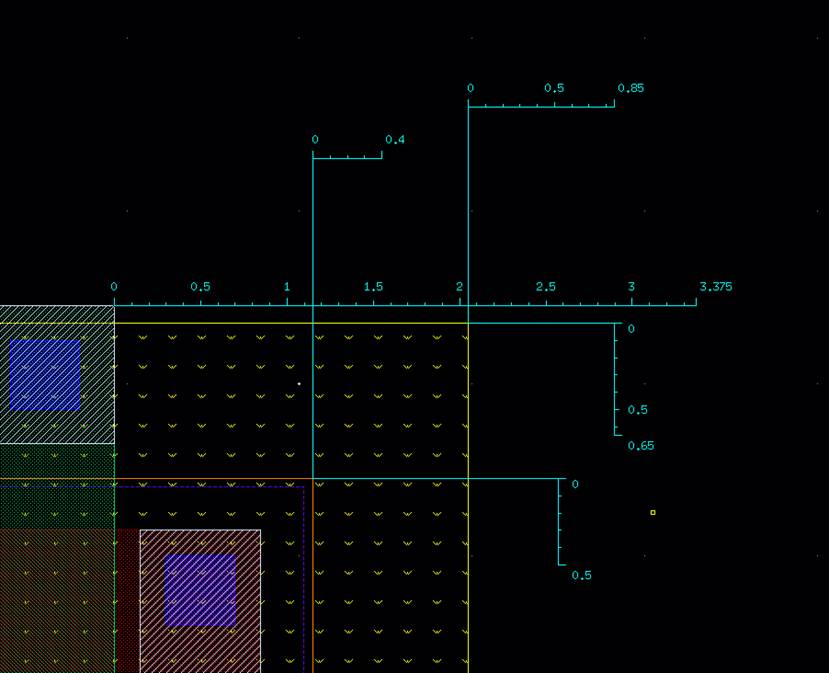

图 27 带刻度的尺子适合测量长度，而不带刻度的尺子更适合当作延长线来打草稿

**L**：label，打标签

如果打标签的时候鼠标选在了一个有多层材料的地方，则会弹出提示让你选择其中的某一层进行标记。

进行LVS检测的时候会检测用金属作为材料打的标签，并且视作一个有名字的接口

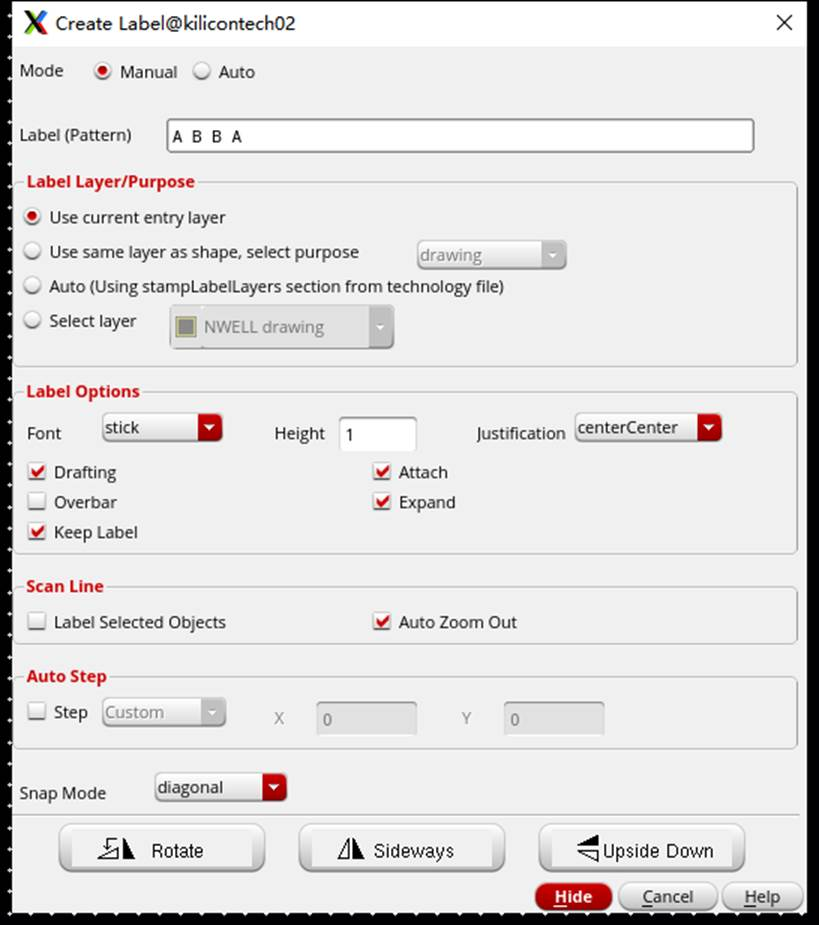

图 28 如图，最上面的输入框内输入ABBA（间隔空格），结果就会触发“连续打标签”功能，会依次打下A、B、B、A、A、B、B、A、A、B、B……还可以Select Layer，选定为text，就像打草稿一样辅助自己；Font选择Roman是最粗最明显的字体，Height是字体大小

**O**：通孔

手动绘图不建议只打一个1×1的通孔，因为通孔的连接点很小，所以通常至少会打1×2的通孔，粗线适当增加通孔数量

Xfab035工艺中，为了方便走线，个人喜欢把各层金属线宽都统一设置成和通孔一样的0.9μm，线的间距一般设置统一的0.6μm，统一的标准可以方便很多画图步骤而且看起来整齐有序，加快上手速度——不过这样的做法是一个新手的胡乱简化措施，因为不同层的金属存在厚度、精度、高度上的差异，不能以版图中看起来的一样就认为它们确实一样

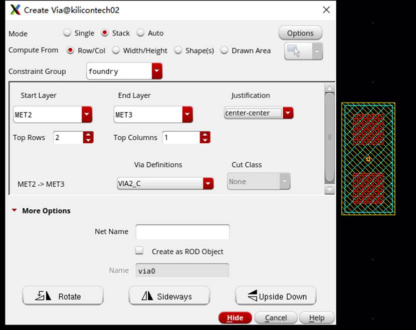

图 29 通孔的设置页面有几种模式，在第一二排的设置里可以选择，如图是最简单的一种设置方式：直观地选择通孔从Metal2穿到Metal3，打一个2×1的通孔

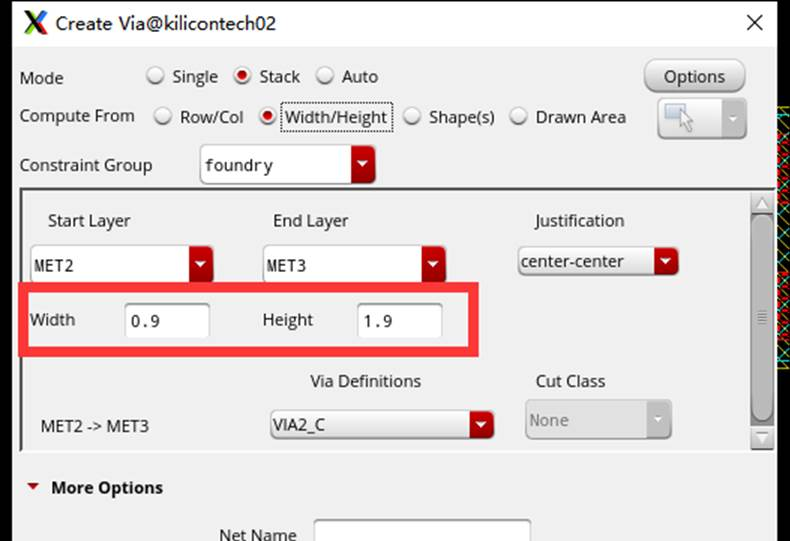

图 30 还可以直接设置长宽

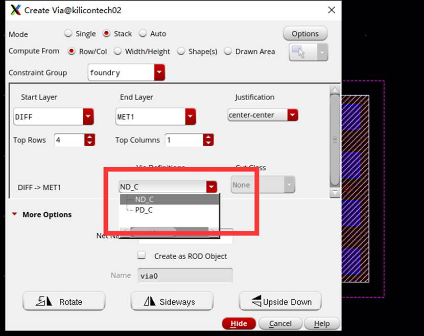

图 31 从DIFF（有源区）到Metal1的通孔，长得和Guard Ring一样，甚至你能设置它是PGuardRing还是NGuardRing

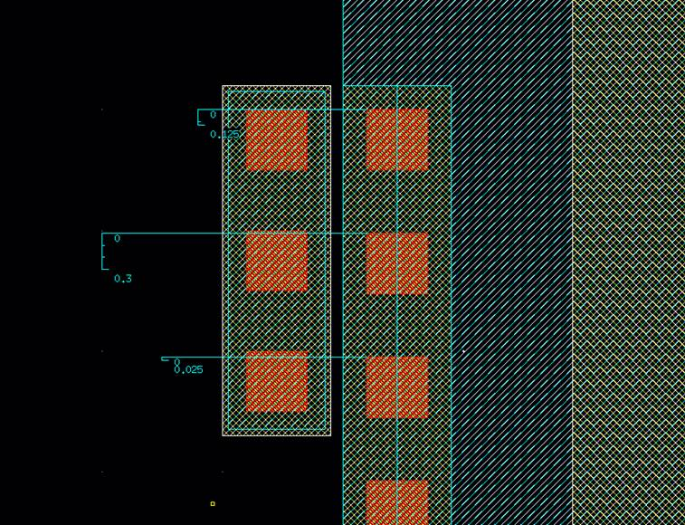

图 32 注意，电容的通孔和手动制造的通孔可能并不匹配

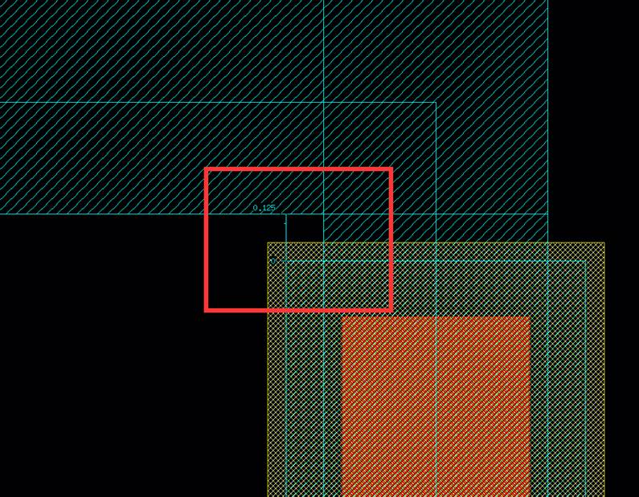

图 33 通孔的常见错误

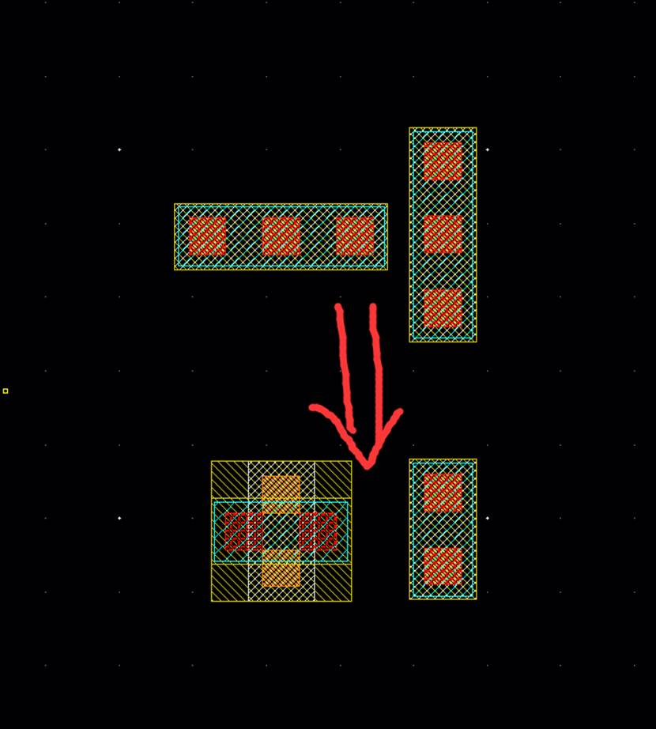

图 34 可以通过鼠标中键来改变横竖方向，但是严谨地说不推荐，因为这个转向过程颠倒了通孔的宽和长，而放置完成后的通孔会重新识别宽和长，导致的结果是，在对已放置的通孔按Q进行编辑后，会出现一个我们不希望的bug。如上图，我们将一个3孔的通孔调整为2孔，旋转过的通孔就变得有点奇怪了。为了避免这样的错误，还是在放置通孔的时候交换长宽数值最为保险

**Shift+G**：Guard Ring

选中要被包围的目标之后，按下Shift+G就能生成Guard Ring了，由于某些原因，你需要多按一次Enter键才能确定下你的Guard Ring，并且确定之后还要按Esc退出Shift+G状态

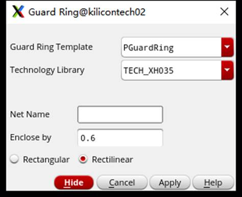

图 35 这个界面你可以选择建造PGuardRing还是NGuardRing，还能设置Guard Ring距离被包围目标的距离——这个默认距离可能不算特别理想，甚至不安全，例如xfab035工艺中，这个距离设置成0.65能避免一个0.6会触发的DRC错误

**Ctrl+Y**：切换层次

当你有多个层次叠在一起的时候，如何选择其中的某一层呢，鼠标左键连续单点可以切换，花哨一点就可以用Ctrl+Y

**X**：进入已选定的模块的本体层次。

Shift+B即可退出X状态

即，按下X之后，除了该选定模块，其他物体将被锁定。接下来的操作只影响选定的该模块。同时，接下来的操作将直接影响到模块的原文件，模块的本体会被修改。（平时的绘图只是调用模块，并不修改模块，调用模块之后在模块上连线等操作也只是在模块的表面添加图案，没有对模块本身进行修改）

标准器件（由工艺厂提供的标准化单元）不得进行修改

这项操作需要十分谨慎，特别是对于一层一层制约的版图

**E**：放置规则设置

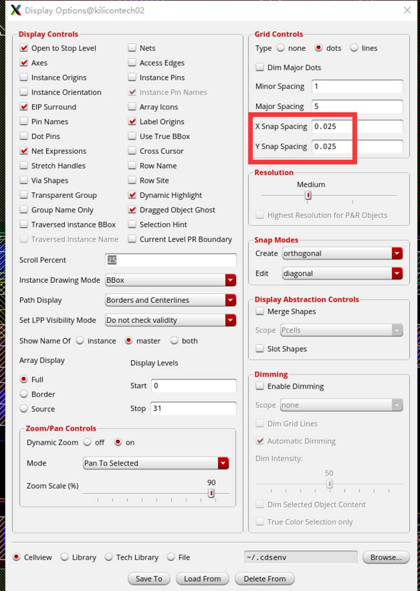

图 36 这里修改绘图最小格点

**界面按钮**：

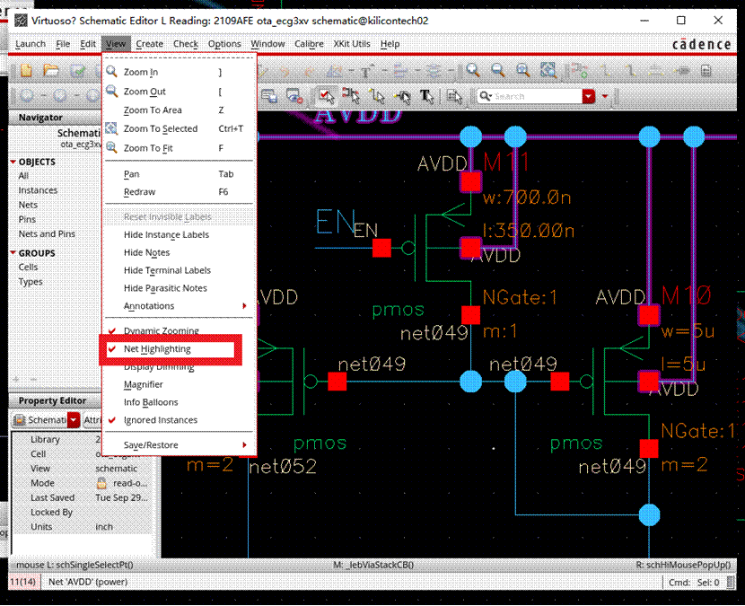

图 37 电路图中的这个按钮相当于版图中的“7”

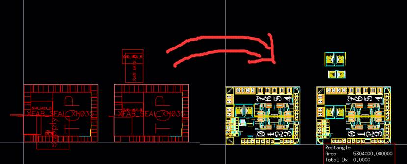

图 38 Shift+F和Ctrl+F可以把这两种视角相互转换，一般打开版图之后都会按一下Shift+F

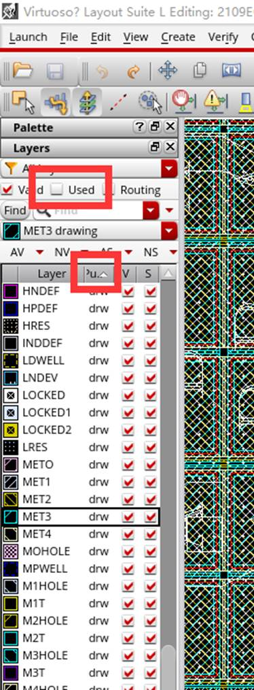

图 39 界面左侧是各种材料，选中Used可以只显示当前出现的几种材料，下面这个按钮可以快速给杂乱的材料名字排个序，注意材料会分为drw型和pin型

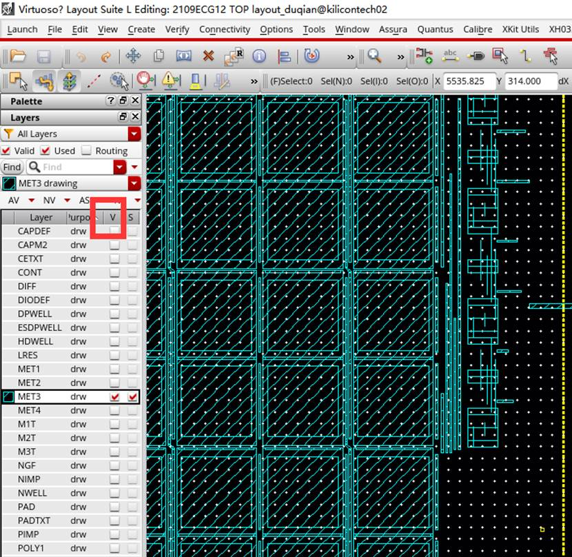

图 40 按V可以快速排除已选层之外的材料层，这样可以只显示选顶层的图案。注意：只是屏蔽了显示，用方框框选的话，未显示的目标仍然会被选中

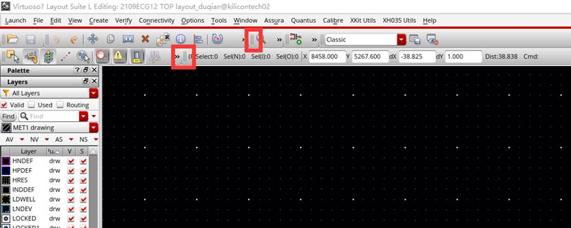

图 41 这个小块可以拖动

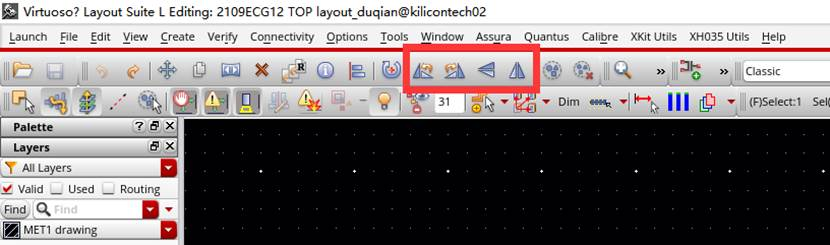

图 42 这四个按钮可以调整已选定图案，分别是旋转和镜像翻转;Shift+O也是旋转，而且是级坐标体系下的角度旋转，不太直观，但是去页面顶上点按钮其实也不方便；一般的旋转，只需要在按键M（Move）的状态下按鼠标中键即可，如需镜像翻转再去点击界面顶上的镜像翻转功能

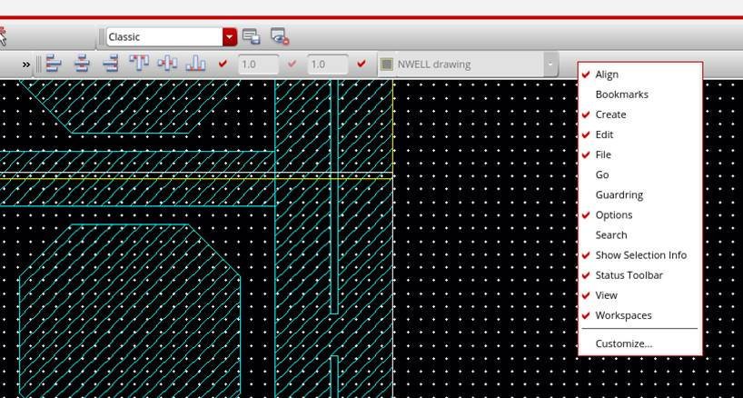

图 43 工具栏右键还有很多选项，比如Align选中后出来的新按钮，可以选择多种对齐方式

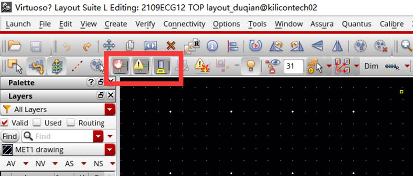

图 44 阻止错误、提醒错误、提醒已发生的错误，这些错误都是指距离的问题，挨得太近或者画的图案太窄等等

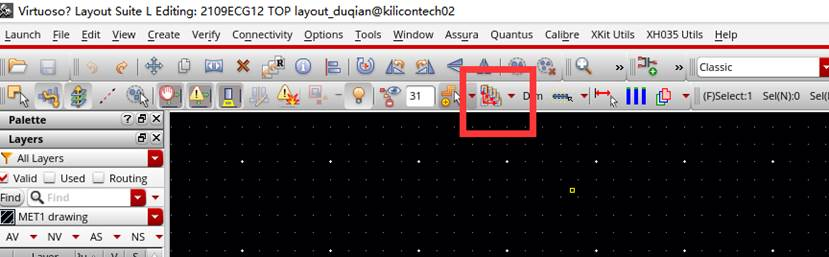

图 45 Any Angle可以使，移动模块的时候随意拖动，在思考布局时很方便，而不是像华容道那样

**布局举例**：

版图布局讲究匹配，其思想在于，通过图案的特殊画法来对抗现实中的缺陷

原理图上完全相同的两个元器件，在实际生产中由于PVT： process & voltage & tempreture 的影响，导致匹配的元器件会有差别，影响的因素主要有如下：

1. 阱偏效应 well proximity effects

由于阱偏效应的存在，导致阱内的浓度不一致，导致阱内器件的阈值电压不同，为避免阱偏效应带来的影响，尽量让器件远离阱边缘

通俗地讲，就像是桌面的一滩水，中间平面十分理想，边缘曲面让人不好计算。同时，放置的器件就像是一块吸水布，如果吸水布太大——我们要想办法在布中间穿插一些“水源”

2. 多晶硅临近效应 poly proximity effects

由于多晶硅刻蚀时，多晶硅布置的不同，会影响刻蚀速度，导致多晶硅的宽长比不同；为避免这种问题，可以通过Dummy 多晶硅来解决；

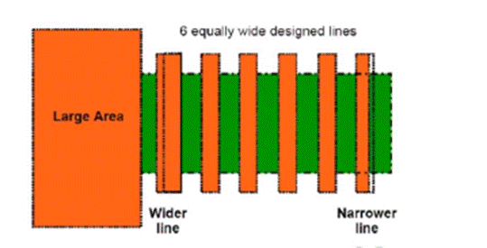

图 46 可以放置两个故意的牺牲品（Dummy）来保全中间部分

3. 金属覆盖晶体管 Metal over transistor

加工的热退火工艺会释放氢气，如果晶体管上方没有金属，则氢气可以正常释放；若上方有金属，则氢气无法正常释放，导致两个晶体管不同；为避免这种情况，匹配的晶体管需要有相同的金属；

通俗地讲，就是器件的摆放讲究完了之后，连线也要注意对称

4. 非对称性

由于隧道效应的存在，为避免隧道效应，离子注入的入射角不能垂直；不垂直注入时，导致有阴影区域的存在；最终导致源漏不对称；

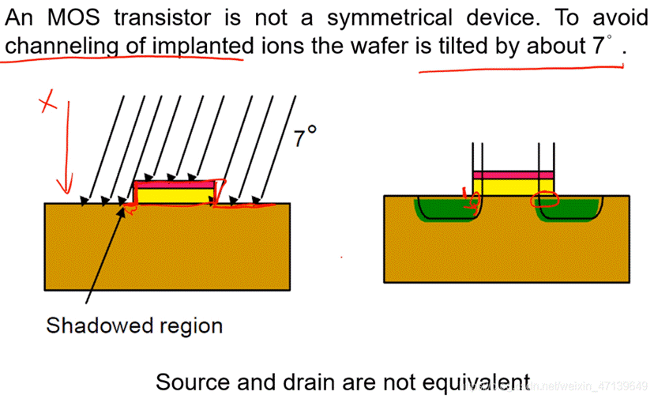

图 47 这个图已经很直观了，再贴近生活一点就是那句，“橘生淮南则为橘，橘生淮北则为枳”

解决方案：

将MOS管做成插指状

保证一对匹配晶体管的摆放方向一致

5. 梯度 Gradients

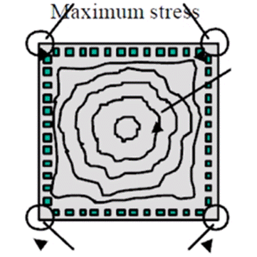

图 48 这一点和生活中的“跨步电压触电”很像，结论就是：我们要尽量让匹配的器件处在同一梯度上，而这种同梯度的区域和梯田一样，一般是环形的

解决方案：

将匹配的器件放置近一些，减少梯度的影响；

共轴心 & 共质心的布局方法；

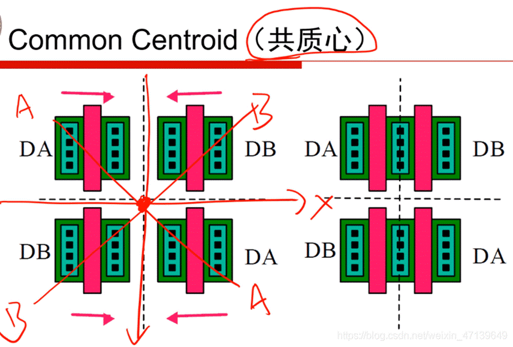

常用的摆放方法如下：

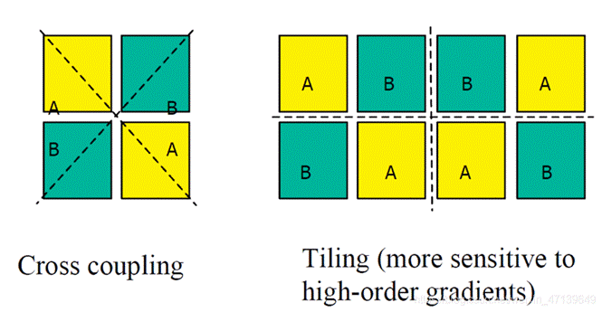

拆解的越细，抗梯度的能力越强，但缺点是连线变复杂，寄生效应增加；常见的拆解方法如下：

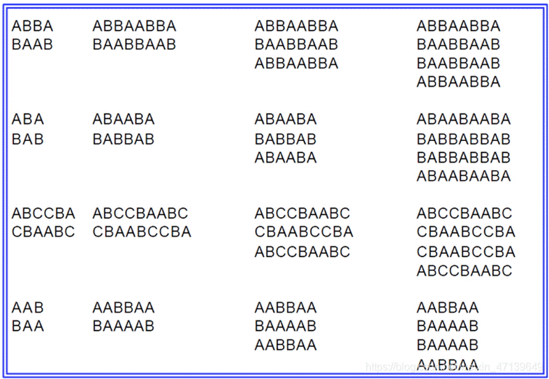

Dummy device

两边的Dummy Device 需要源漏短接，Dummy Device 不可以工作；

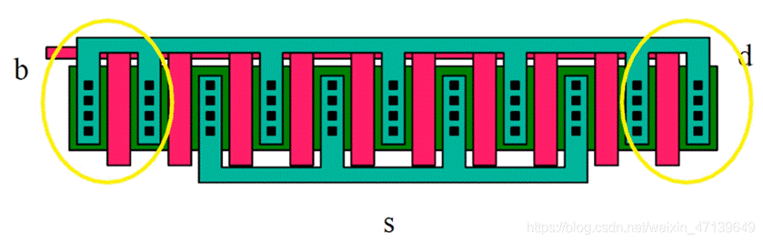

导线匹配

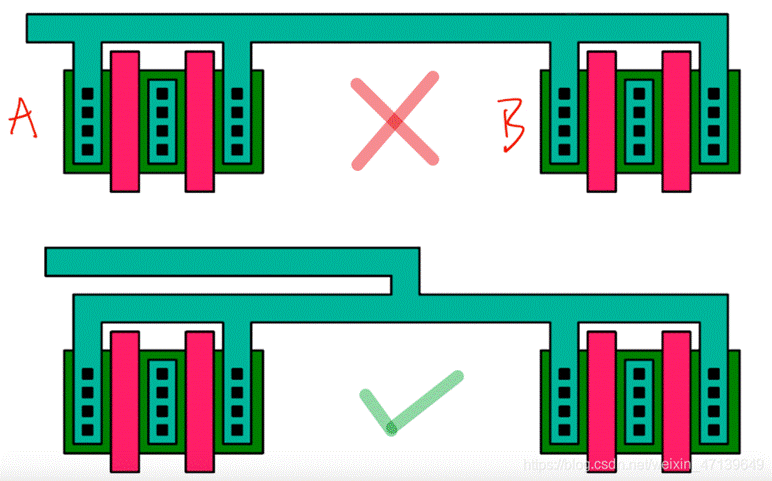

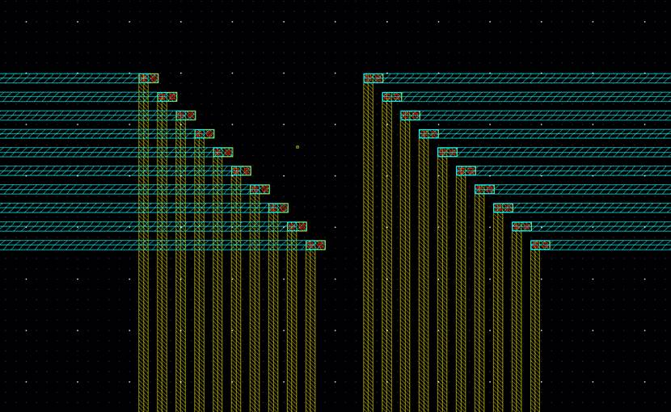

图 49 这两种折线方式各有优劣，左侧方式可以使得金属线长度一致，这个优势在三个及以上器件之间的连线中失效——不用考虑太多，两种方案一起用，实地分析即可

匹配原则

1. 电容匹配原则

使用相同的几何形状；

使用大的子单元电容，为了降低边缘效应；

子单元采用共质心的布局方式，为了抑制梯度影响；

在边缘使用Dummy 电容，降低边缘影响；

使用屏蔽处理，减少其他位置的干扰 & 耦合；一般电容的下方画出一块N阱，并接固定电位；

考虑导线匹配，主要因为寄生参数的影响；

在电容上不要穿过导线；

注意：xfab035工艺中，电容区域占据了所有的金属层，想要穿过电容走线是不可能的，（即使可以走也不要走，电容是一大块金属，寄生影响比较大），所以画版图的时候应该优先考虑电容的大小和位置，考虑好要不要把电容集中在某一块区域，不然后期连线会四处碰壁

电容要放置在低应力区域；

电容要远离功率器件；

2. 电阻匹配原则

电阻和电容相对来说都是“大物件”，电容通常是方的，电阻是长条状的，再加上电阻更容易受温度影响，所以需要额外注意摆放的方向问题

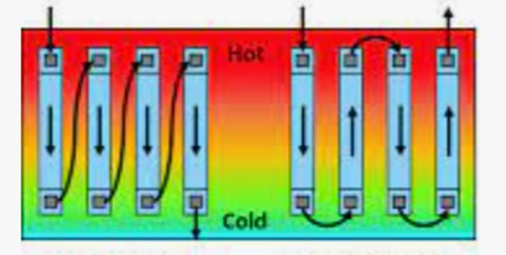

图 50 右侧是更好的匹配方式

电阻使用相同材料（阱掺杂，多晶硅等）——电容中未提及此项，因为一种工艺中，一般只使用一种电容结构，而电阻可以存着多种；

相同的几何形状 & 摆放方向；

近距离放置；为了减小梯度影响；

使用Dummy；

使用屏蔽；

3. 匹配原则：

匹配的元器件要放置的很近；

匹配的元器件方向一致；

选择中等的子单元

这句话的意思指：假设一个器件数值是6，另一个器件数值是8，那么可以拆成2+2+2和2+2+2+2这样的以2为基础的组合模块——这样的做法多少有点更改电路的嫌疑，有些地方是不能改的，没有十足的把握就不要这么做

采用插指状（finger）共轴心的方式；

使用Dummy包裹核心元器件；

共质心

匹配连线；

保证有所元器件均具有对称性；

匹配器件尽做大，因为大的器件，偏差百分比相对变小；但也不能太大，因为功耗会增加；

这句话的意思是：误差是基于精度的一个比较固定的数值，如果主体做的比较大，那么误差就相对比较小

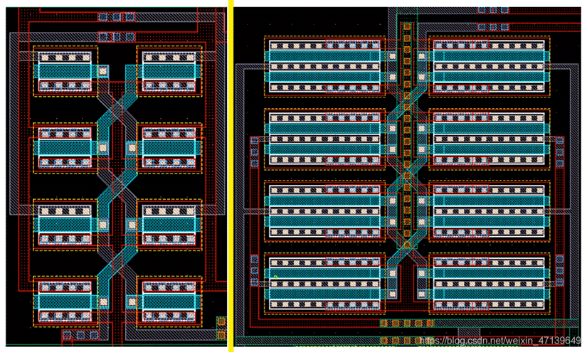

图 51 两个匹配的例子，它们总是有一些相似的美感，或者说不匹配的电路图往往看起来就然人头疼

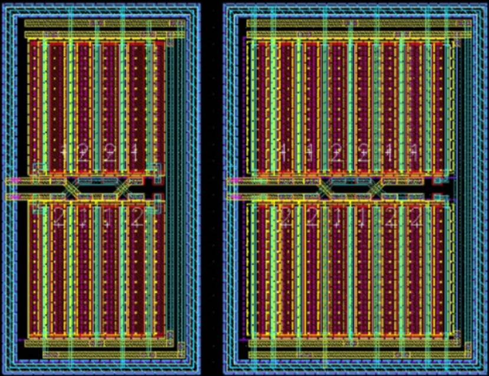

图 52 两个匹配的例子

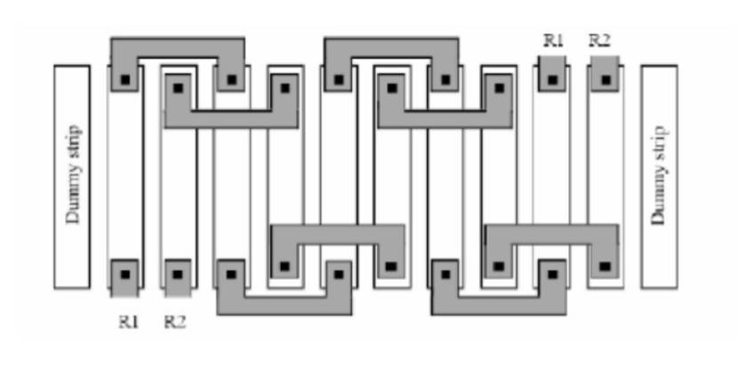

图 53 叉指结构电阻，但是注意，电阻上面走金属线可能不太合适，像xfab035工艺中直接禁止在电阻上画最底层金属

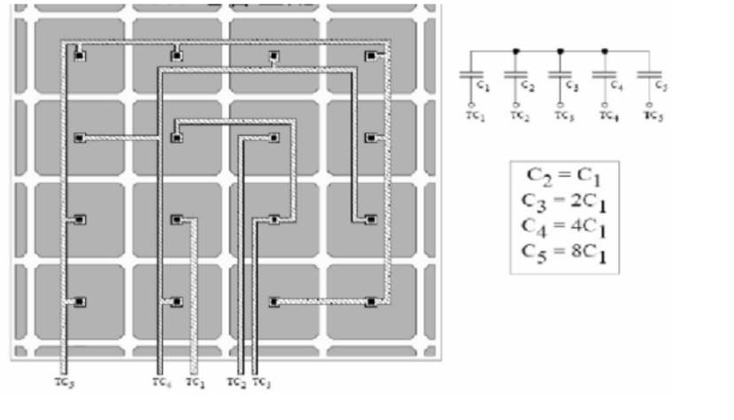

图 54 使用单位电容的电容匹配方式

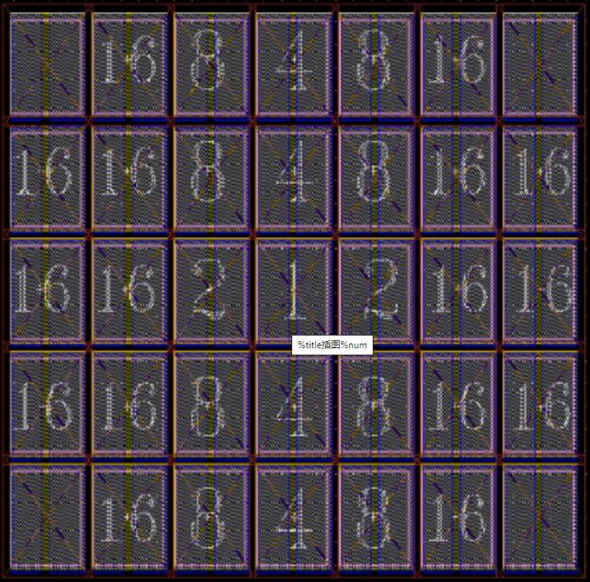

图 55 1:2:4:8:16电容匹配

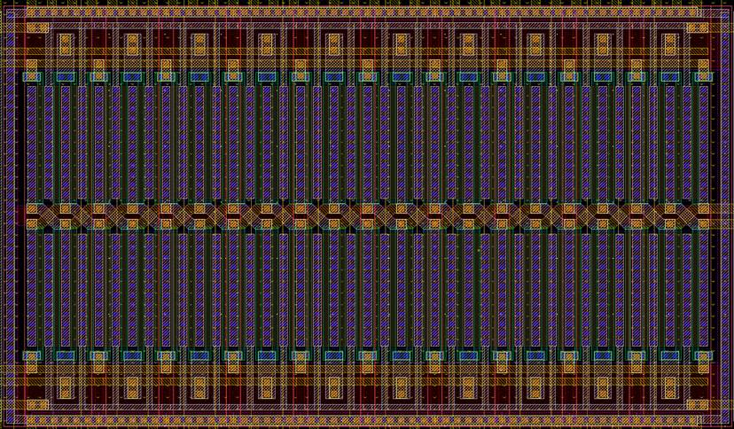

图 56 一种pmos匹配方式，由于尺寸较大，在中央添加了一条横着的有源区（红色点状）来“供电”

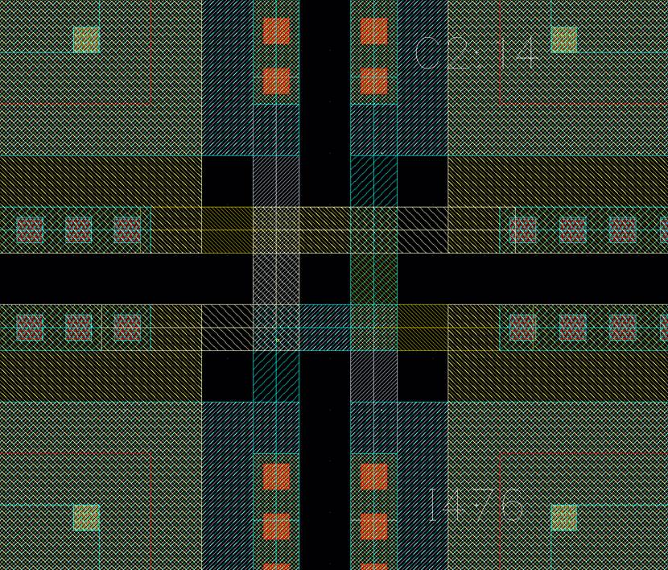

图 57 一种电容间连接方式，左上右下连，左下右上连

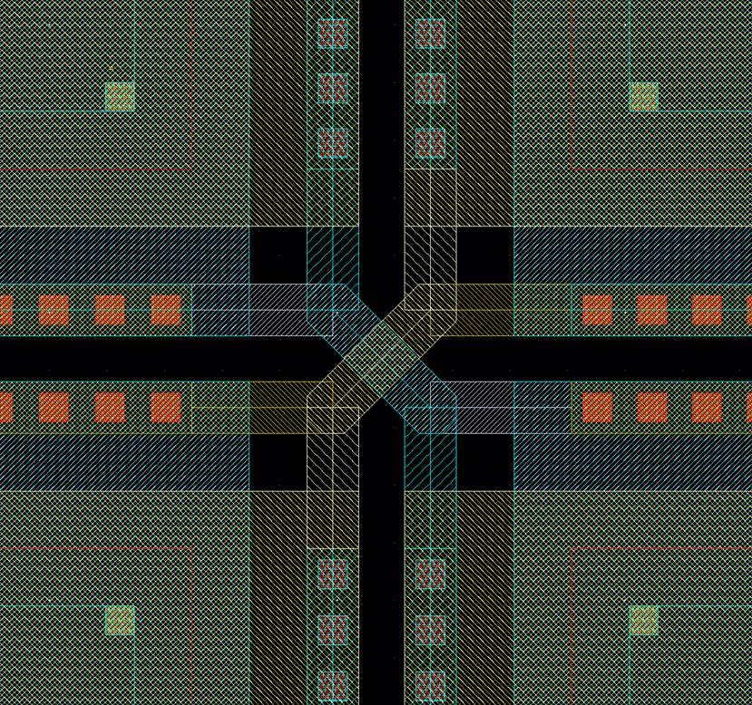

图 58 一种电容间连接方式，左上右下连，左下右上连

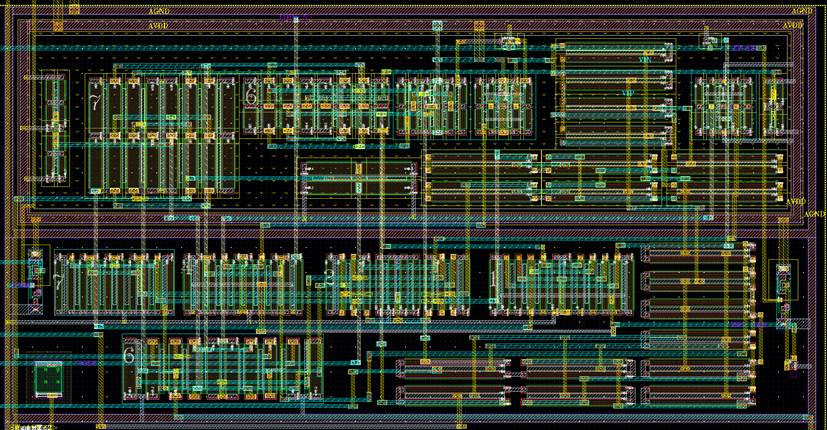

图 59 较大的模块可以单独加环，对于小东西，可以pmos放一块，nmos放一块，共用一个Gaurd Ring。上图分为上下两块区域，上面是pmos，下面是noms

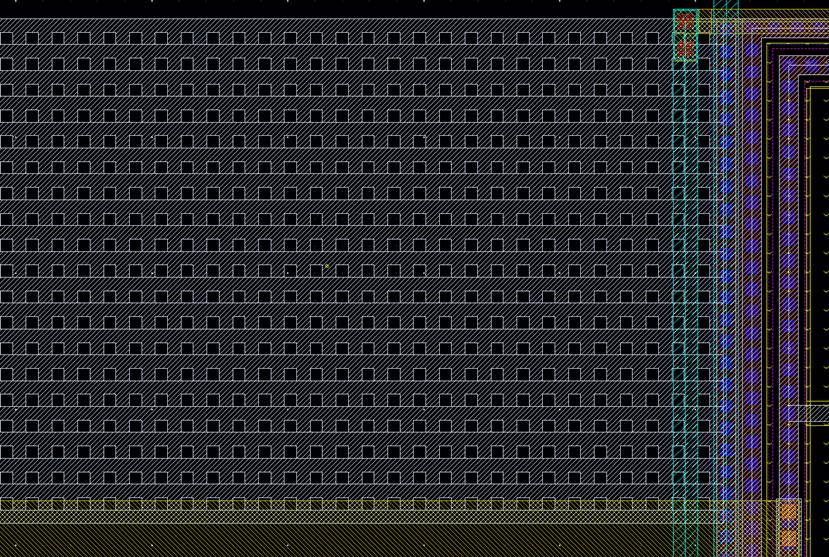

图 60 如果想要添加一块超级大的金属（如果不必须，应该意识到导线太大也有缺点），它会报错的，因为金属宽度过大会使其受到的压力不均而断裂。不过做成网状就可以解决这个问题——试试Ctrl+Shift+X和Shift+M按钮（如图便是用这种画法，空洞整齐有序，但是电子容易聚集在金属边缘，久而久之会加速金属老化，更加正确的做法是，让空洞交错排布）

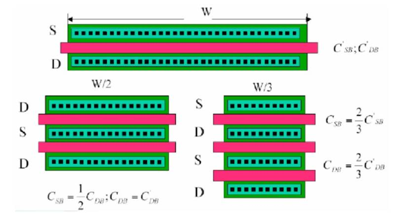

图 61 晶体管分开并联

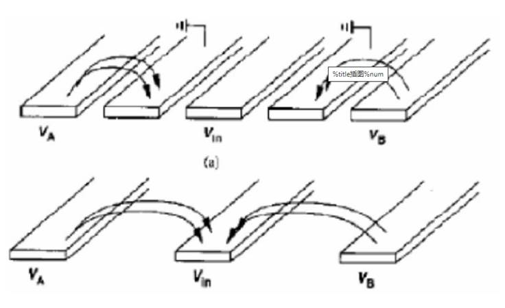

图 62 噪声隔离示意图，最中间是要保护的信号线，最左侧和最右侧是干扰源

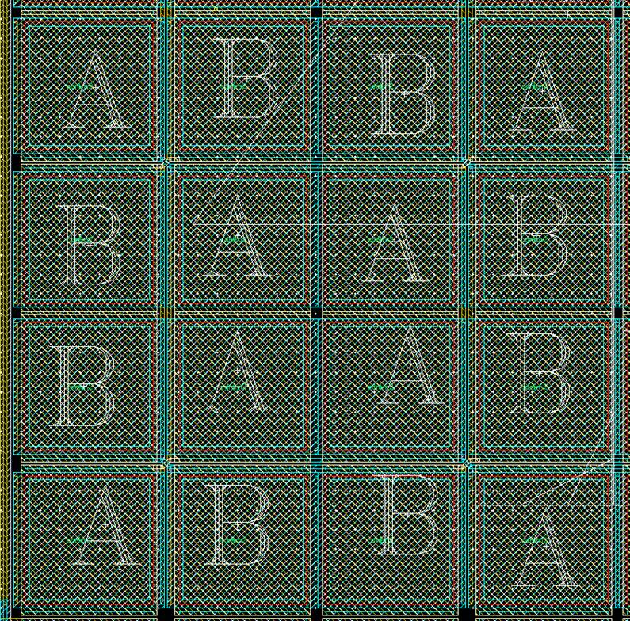

图 63 横竖都满足ABBA的电容布局方式

**天线效应**：在工艺干法刻蚀时会在晶片表面淀积电荷，暴露的导体可以收集能够损坏薄栅介质的电荷，这种失效机制称为等离子致损伤/天线效应

通俗的说就是不要用同种金属连太长的线，如果非得走长线，就不同层金属跳层走。

最不得已的情况就是在金属线上接一个二极管到衬底，这个做法必须和电路工程师沟通

**闩锁效应**：稍微复杂，大概地讲解决办法就是：遇事不决加Guard Ring接地，直接一个环套起来不留死角