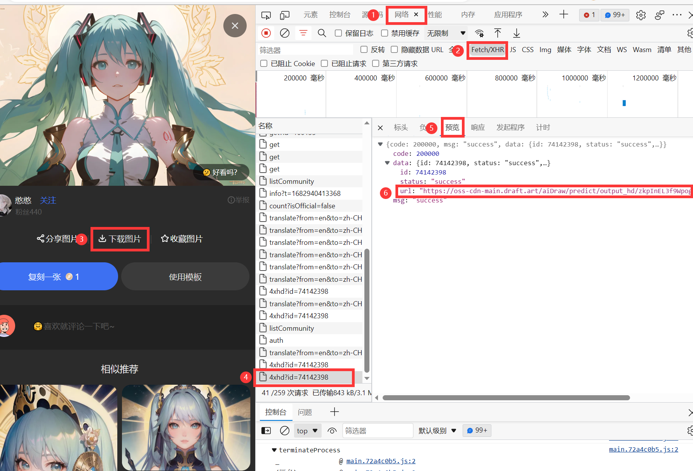

为什么要单独说引入外部图片这件事呢

一是降低服务器负载，提升网络浏览体验；二是有一些非常隐秘的方式获取网络资源，我在网上还不太搜得到，这里写下一些不太道德的获取图片的方式，因为能直接获取的图片往往别人的网站不太在意这些流量，而难以获取的图片链接一般是为了让我不要“抢夺”他们的资源

我尽量去抢夺ai制作的图片，因为ai的学习资源来自全人类，版权问题很难有定论；同时互联网的链接只要存在，就意味着是不限制访问的，除非它自己关闭链接。所以这样看来我就没什么重大错误了

------

比如[https://draft.art/](https://draft.art/)这个网站，它是做ai图片生成的，在里面有很多很多ai生成的图片资源，而你无法直接获取图片的链接，网站的制作者甚至把鼠标右键、f12都阻拦了下来

1. 首先破解f12，你可以点击浏览器的设置键找到开发者选项

2. 开发者选项的左上角有个`在页面中选择一个元素以进行审查`，或者叫`Ctrl+Shift+C`，用这个找到下载按钮，查看网页代码中下载按钮指向的链接

3. 当然，当成例子来说肯定是不会让你很快乐地直接找到链接地址的，你会发现下载按钮没有链接，下载图片之后在浏览器的下载界面复制下载链接之后，得到了这个东西：
   ```http
   blob:https://draft.art/53f5ac73-29f7-4f48-a0c6-5b4314c1ca75
   ```


4. blob开头显然并不是一个链接，查了一下网上的资料总之这个链接很难使用了，但是毕竟我们点击下载之后确实有下载一个图片文件，那么找到下载的各种处理完成的最后的那个链接就很关键

5. 于是在开发者界面里找到`元素``控制台``源代码``网络``性能`……中的`网络`，紧接着找到`Fetch/XHR`,在这个界面里点击下载按钮，你就可以看到更加底层的链接了，这个链接是

   ```http
   https://oss-cdn-main.draft.art/aiDraw/predict/output_hd/zkpInEL3f9WpogF8zInfqM3tCDWlRyzE-0.jpg
   ```

   这个链接地址末尾的jpg就很亲切了




```md title='我们把它写到markdown文件里就能输出图像了'

```


