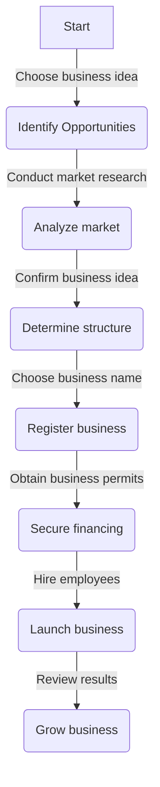
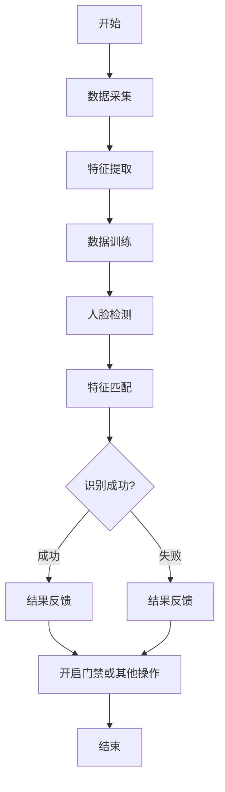

# create a company

Hello! How can I assist you today?

## Write a flowchart in Markdown format that supports mermaid, describing the steps to create a company

Sure, here's a flowchart in Markdown format for creating a company:



`````md
````mermaid
graph TD;
    Start[Start] -- Choose business idea --> Identify(Identify Opportunities);
    Identify -- Conduct market research --> Analyze(Analyze market);
    Analyze -- Confirm business idea --> Determine(Determine structure);
    Determine -- Choose business name --> Register(Register business);
    Register -- Obtain business permits --> Secure(Secure financing);
    Secure -- Hire employees --> Launch(Launch business);
    Launch -- Review results --> Grow(Grow business);
这里有```符号，请忽略中文
````
`````

This flowchart depicts the steps for creating a company, including choosing a business idea, conducting market research, determining business structure, registering the business, securing financing, hiring employees, launching the business, and growing the business.


