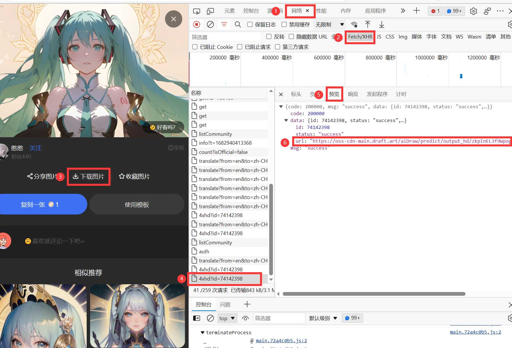

[点击此处搜索图床的作用。](https://cn.bing.com/search?q=图床的作用)

为什么要单独说引入外部图片资源这件事呢。

一是降低服务器负载，提升网络浏览体验；二是有一些非常隐秘的方式获取网络资源，我在网上还不太搜得到，这里写下一种获取图片的方式，因为能直接获取的图片往往别人的网站不太在意这些流量，而难以获取的图片链接一般是为了让我不要“抢夺”他们的资源。

我尽量去抢夺ai制作的图片，因为ai的学习资源来自全人类，版权问题很难有定论；同时它挣的钱相当于小区物业贴的广告，也就是价值应该归属全人类而只给经营者一些辛苦费。所以这样看来我就没什么重大错误了。

------

比如[https://draft.art/](https://draft.art/) 这个网站，它是做ai图片生成的，在里面有很多很多ai生成的图片资源，而你无法直接获取图片的链接，网站的制作者甚至把鼠标右键、f12都阻拦了下来。

1. 首先破解f12，你可以点击浏览器的设置键找到开发者选项。

2. 开发者选项的左上角有个`在页面中选择一个元素以进行审查`，或者叫`Ctrl+Shift+C`，用这个找到下载按钮，查看网页代码中下载按钮指向的链接。

3. 当然，当成例子来说肯定是不会让你很快乐地直接找到链接地址的，你会发现下载按钮没有链接，下载图片之后在浏览器的下载界面复制下载链接之后，得到了这个东西：
   ```http
   blob:https://draft.art/53f5ac73-29f7-4f48-a0c6-5b4314c1ca75
   ```


4. blob开头显然并不是一个链接，查了一下网上的资料总之这个链接很难使用了，但是毕竟我们点击下载之后确实有下载一个图片文件，那么找到下载的各种处理完成的最后的那个链接就很关键。

5. 于是在开发者界面里找到`元素``控制台``源代码``网络``性能`……中的`网络`，紧接着找到`Fetch/XHR`,在这个界面里点击下载按钮，你就可以看到更加底层的链接了，这个链接是：

   ```http
   https://oss-cdn-main.draft.art/aiDraw/predict/output_hd/zkpInEL3f9WpogF8zInfqM3tCDWlRyzE-0.jpg
   ```

   这个链接地址末尾的jpg就很亲切了。

   

6. 但是，这个链接放在浏览器里你不能访问到图片，而是直接弹出下载，并且然而当你放到你自己的网站中去的时候，它很难被加载出来。关于这个问题，要回答两个事：

   * 链接的下载或是预览，取决于图片服务器那边输出的是一串用来下载的值还是一张图，不过问题并没有出在这里，这个事情我们不用多考虑，只管把链接引入到网页中就行。

   * 我们在浏览器地址栏中打开链接可以直接访问到图片资源，而让网页来做这个事就失效了，说明是**我们的网页被图片站区别对待了**，解决办法很简单，告诉它我来取走你的东西，但是我本身，是人是鬼不知道：

     ```html
     <meta name="referrer" content="no-referrer" />
     ```


至此，我们的强盗行径给了同样强盗的AI绘图从业者一点小小的黑吃黑震撼，下面就是一张抢来的AI作品：


```md title='我们把这段文字写到markdown文件里就能输出图像了'

```


