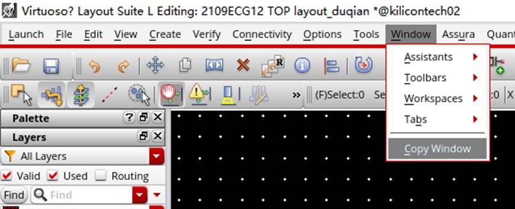
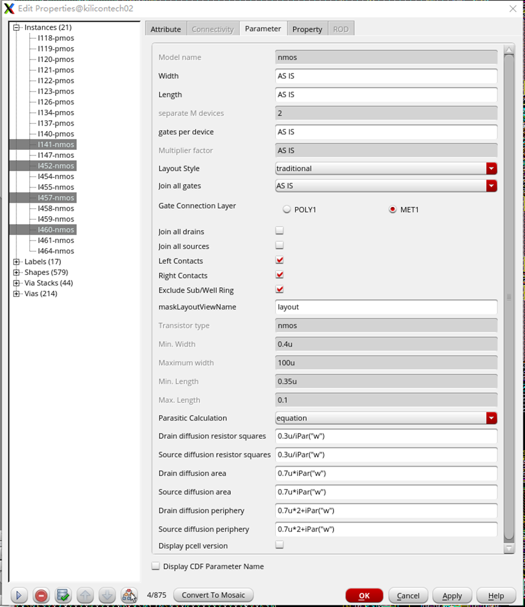
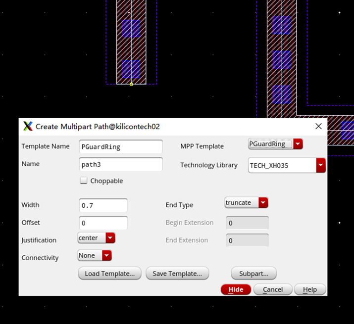

# Cadence Virtuoso 使用笔记

此笔记不从专业角度，也不系统化详细说明。仅站在自学和使用角度，从软件常用功能入手，逐步深入

暂时针对 xfab035 工艺进行举例，普适性有待检查

## 重要的快捷键

### U

Undo，撤回

### Esc

退出

经验来讲，当你不小心按错了什么按钮，操作状态比较古怪的的时候，按 Esc 退出当前状态

如果按 Esc 不起作用，大概率就应该按 Shift + B 了

这里 Shift + B 指不小心按到X键的情况，进入更深一层的模块编辑模式，使得当前页面中大部分内容无法编辑，看起来就像是卡死了一样

### F2

保存

### F3

打开所有进行中的绘画动作的设置界面

### F4

在任何一个有选项的界面，比如按下 F3 之后，可以进行交互

### Delete

删除

既可以选中目标再按 Delete，也可以先按 Delete 进入删除模式，然后使用鼠标左键快速删除

###  Backspace

 回退

当你的操作需要多次点击的时候（例如 P 或者 Shift + P 这样需要弯折多次的过程），如果其中某一步点错了，按下 Backspace 即可倒退一步，而不用完全地重新操作一次

### Shift

按住 Shift 不动，鼠标左键可一次性选择多个目标

### ↑ ↓ ← →

移动视角

一共有三种方法来移动视角，分别是

1. 按住鼠标中键拖动
2. 滚轮放大缩小配合鼠标移动改变视角
3. 键盘上下左右

有些时候前两种方法会失效，但键盘的上下左右移动视角非常强制性

还可以通过双屏的方式同时拥有两个视角，这两个视角是实时同步的

### Q

打开已选定目标的详细信息

可以更改这些信息来改变已绘制的图案，例如 pmos 更改为 nmos

该界面左侧可以按住 ctrl 或者 shift 进行多选，使右侧操作同时对多目标生效

此界面本质上一直存在，所以如果 Q 页面单纯被别的页面覆盖（即，没有关闭 Q 的页面而转移到其他页面上去，导致 Q 窗口看不见），再次按 Q 不会有反应，因为 Q 页面已经被打开，此时应该按下 Esc 关闭被隐藏的 Q 页面，再重新按 Q

在电路图中，已选定器件的详细信息也是按 Q 来呈现

电路图中对某器件按 Q，会使该器件的信息被临时记住，此时转向版图页面，在版图中按 I 新建器件，若新建器件的种类和电路图中被记住的器件种类一致，则会自动填写器件详细信息

按下 Q 之后的详细页面，该页面信息可以编辑，直接影响对应的器件

### P

画线，即绘制最基础的连接线

绘制过程中无法切换线材

按下 N，解锁 45° 倾斜的直线

按下 ctrl + N 可以直接绘制折线，这一点非常重要，几乎所有折线都能用上

绘制折线时，鼠标中键可以改变弯折的方向（Snap Mode）

假设当前共有四层金属，连线基本规则是 1、3 层金属横向，2、4 层金属竖向。有时候模块旋转之后会反过来，没关系，模块之间可以不强求统一，但单个模块内部要统一

尽量优先用层数低的金属，给后面的连线留退路

一条线画完之后按空格可以弹出一个打通孔的界面，但是似乎只能打单孔，单孔通孔是不推荐的，强度不够

Create → Multipart Path → F3 可以选择像画金属线一样画 Guard Ring（此功能默认没有快捷键）

