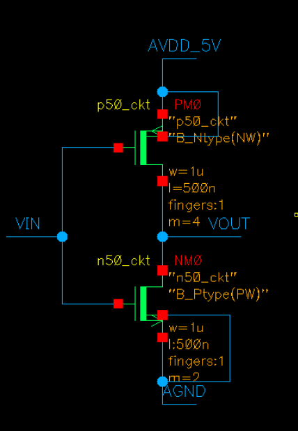
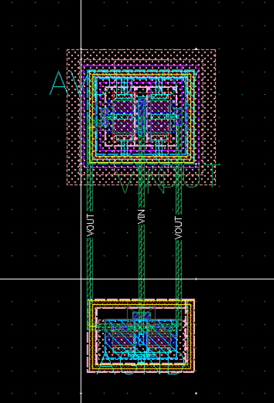
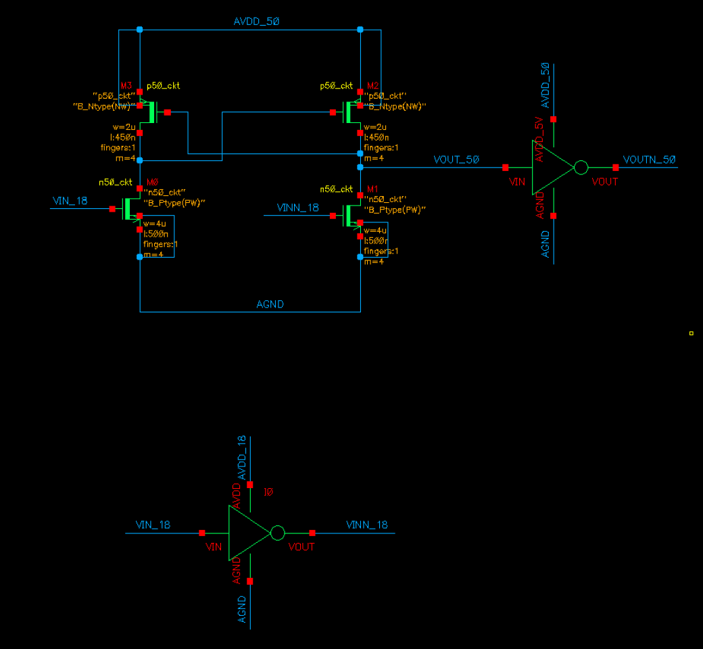
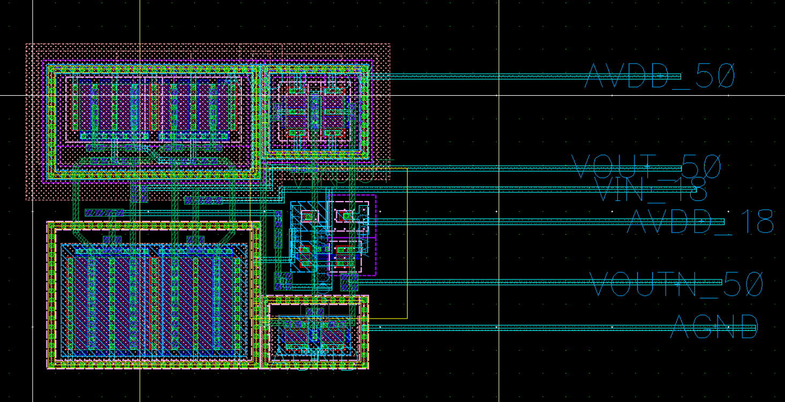
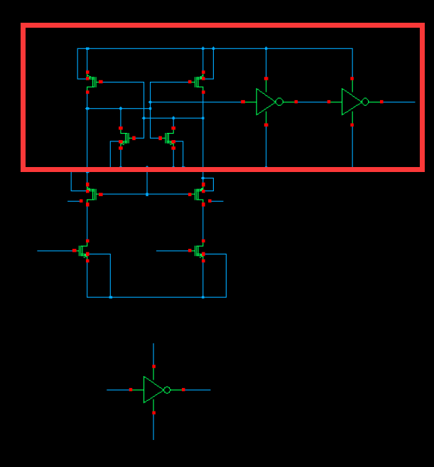
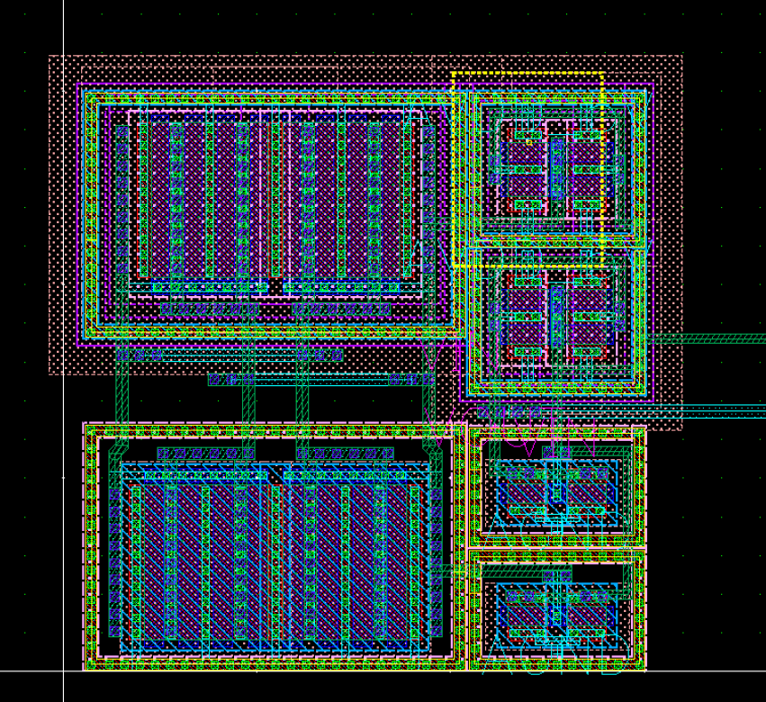

# 20240305

3.1周五

画了个反相器熟悉一下

| Library  | Cell   | View   | DRC  | LVS  | 备注 |
| -------- | ------ | ------ | ---- | ---- | ---- |
| STIM2402 | inv_5V | layout | ✔️    | ✔️    |      |

3.4周一

重画了反相器，电平转换器

| Library  | Cell         | View   | DRC  | LVS  | 备注 |
| -------- | ------------ | ------ | ---- | ---- | ---- |
| STIM2402 | STIM_V18_V50 | layout | ✔️    | ✔️    |      |

3.5周二

DEMOS和LDMOS还不会，下午问袁嘉润

| Library  | Cell        | View   | DRC  | LVS  | 备注 |
| -------- | ----------- | ------ | ---- | ---- | ---- |
| STIM2402 | STIM_V5_V40 | layout | ❌    | ❌    |      |

