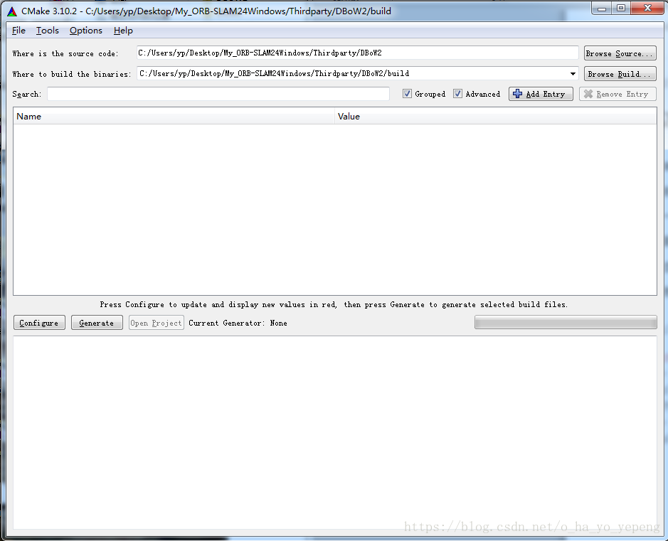
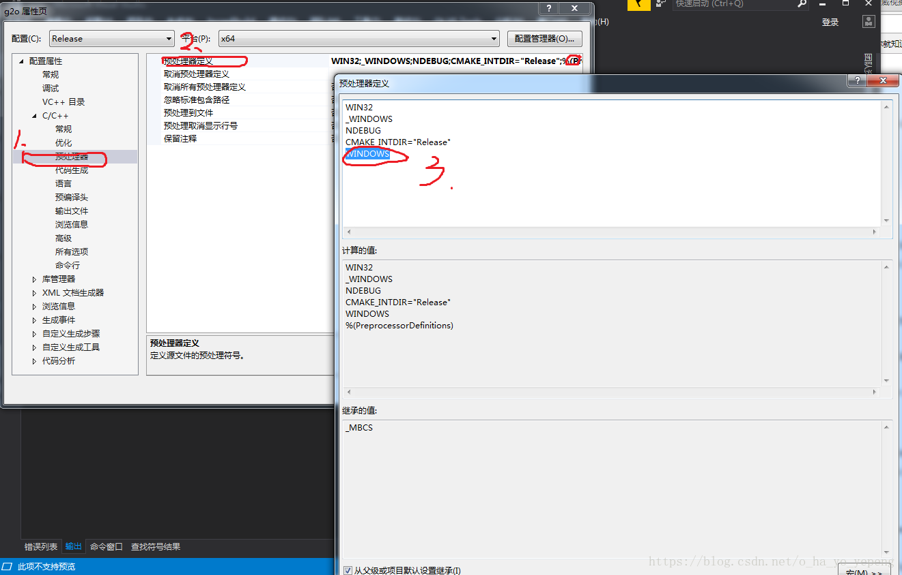

（此工程源码我已经上传到`CSDN`上，请直接下载然后按照以下步骤编译构建工程，下载地址 [My_ORB-SLAM24Windows](https://download.csdn.net/download/o_ha_yo_yepeng/10371568) ，然后再在其下进行编译，为了下次还可以用这个文件编译，此处我是将其拷贝到桌面`C:\Users\yp\Desktop\`下的）。

## 1. `OpenCV`库：

1）`OpenCV`是一个用于图像处理的三方库，它的软件下载目录 [Opencv-2.4.13](https://sourceforge.net/projects/opencvlibrary/files/opencv-win/2.4.13/)，注意这里需要 根据VS版本选择解压不同的opencv版本的软件。

| VS版本               | vc编译器版本 |
| -------------------- | ------------ |
| `Visual Studio 2012` | `vc11`       |
| `Visual Studio 2013` | `vc12`       |
| `Visual Studio 2015` | `vc14`       |

2）点击安装软件，自定义安装路径，此处我是解压安装到目录`G:\Program\`下的，解压出来的目录如下：


## 2. `DBoW2`库：

`DBoW2`库是项目里面 主要用来做重定位和回环检测的。重定位指图像如果变化太快，特征点跟丢之后，我们可以利用词袋模型（`Bag of Word`）去匹配场景中的物体，如果相似度到一定程度，则可以认为找到了之前的相似场景，则系统可以重新追踪到特征点并且运行起来；回环检测相机运行了一圈，由于累计误差会越来越大，对此，我们可以在相机回到了原来走过的位置的时候，可以利用词袋模型识别场景的方法识别出相机此刻的位置，并用这个值来优化之前的估计的轨迹，让运动轨迹更加精确。注意这个库的编译需要`OpennCV`库的支持，所以需要事先安装好`OpennCV`库。
1）打开`CMake`软件，点击`Browse Source`键，选择`DBoW2`库所在目录，此处我的目录是
`C:\Users\yp\Desktop\My_ORB-SLAM24Windows\Thirdparty\DBoW2\`；

2）点击`Browse Build`键，选择编译文件的放置目录，此处我们在DBoW库的目录下新建一个 `build`文件夹，然后 点击 `Browse Build` 键 选择此文件夹；




3）点击 Config 按钮 配置库，按照VS版本选择自己的编译格式，点击Finish；


4）然后会看到提示报错，点击ok，看红色的报错提示，可以看到报错是因为没有找到OpenCV的lib库；


5）将右上角的Grouped 和Advanced 框前打上勾。并点击OpenCV一栏，选择lib目录（此处目录根据自己安装的OpenCV路径而定），并将OpenCV_FOUND 后面的框打上勾，如下；


6）再次点击Config配置项目；

7)点击Generate 生成项目，并点击Open Project打开工程；


8）先调节Debug和Release版本，此处我整个工程使用的是Release版本，所以此处选择Release版本，注意后面的64和32位是在CMake生成项目的时候选择的，在此处不能修改，否则会出错。然后右击ALL_BUILD 键，选择生成，生成项目；


9）生成成功如下；

生成成功后会在DBoW2库目录，下面生成了lib库目录，这里生成的就是DBow2库的.lib文件：


至此，DBoW2库就配置生成好了。

## 3. `g2o`库：

G2o库主要是做图优化的，即优化精确计算结果。

1）同上，点击Browse Source 键选择源目录，然后在g2o库的目录下新建build文件夹，再点击Browse Build 键选择此buid文件夹作为输出目录，点击config配置，会有警告，不过不用理会。如下


2）点击Generate 按钮生成，并点击Open Project打开工程；同上将项目调节成Release模式；并且右击 g2o项目，选择 属性，按下图在预处理器一栏增加WINDOWS；



点击确定退出，随后右击右击ALL_BUILD 键，选择生成，生成项目；

查看g2o库下有没有生成lib文件夹，并且其中有没有生成.lib文件；

至此，g2o库编译完成。

## 4. `Pangolin`库：

Pangolin库主要是用来做系统交互和演示用的库。
1）同上，点击Browse Source 键选择Pangolin库源目录，然后在Pangolin库的目录下新建build文件夹，再点击Browse Build 键选择此buid文件夹作为输出目录，点击config配置，再点击Open Project按钮打开项目。


2）注意，Pangolin库编译的时候会在git上下载一些依赖库，需要先打开Shadowsocks，下载地址：；
还需要打开Git软件，在窗口中输入

```git
git config --global http.proxy 'socks5://127.0.0.1:1080'
```


点击enter。

3）接着右击ALL_BUILD 选择生成项目，因为编译生成的过程中会下载一些文件。所以需要编译时间会长一些。期间会报错 LNK1181 无法打开输入文件“pthread.lib”，无须理会。生成成功后也会在Pangolin库目录下生成lib目录，并在其中生成.lib库。


## 5. `eigen`库：

Eigen库是一个模板库，无需编译。
至此，所有构建ORB-[SLAM](https://so.csdn.net/so/search?q=SLAM&spm=1001.2101.3001.7020)依赖的三方库都已经构建编译完毕。
