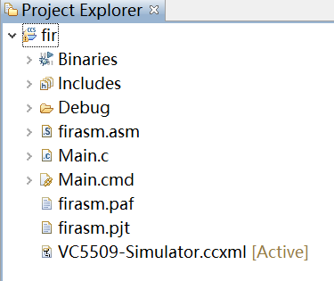
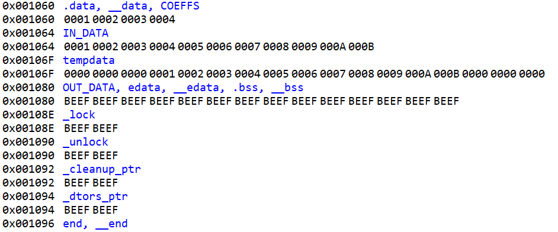
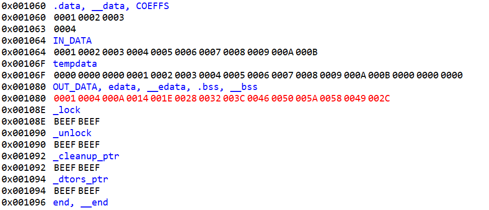

# FIR滤波的汇编实现

班级：电子2011

姓名：杜谦

学号：19200106136


## 原理简介

如果我们有一个长度为 N 的 FIR 滤波器，输入信号为 x[n]，输出信号为 y[n]，系数为 h[k]（其中k 可以从 0 到 N-1），则输出信号的计算公式如下：


$$
y(n) = \sum_{k=0}^{N-1} h(k) \cdot x(n-k)
$$

这个公式表示输出信号的每个采样点是输入信号的一系列过去采样点与对应系数的乘积之和


## 汇编代码总览

该滤波器的阶数为4，输入数据长度为11

```armasm

N_TAPS .set 4
N_DATA .set 11
	.def COEFFS
	.def IN_DATA
	.def tempdata
	.data
COEFFS .int 1,2,3,4
IN_DATA .int 1,2,3,4,5,6,7,8,9,10,11
tempdata .int 0,0,0,1,2,3,4,5,6,7,8,9,10,11,0,0,0
	.bss OUT_DATA, N_DATA + N_TAPS - 1, ,1
	.def _firtst
	.text
_firtst:
	BCLR ARMS
	.arms_off
bfir:
	
	MOV	#(N_DATA+N_TAPS-2),BRC0
	MOV	#(N_TAPS-1), CSR
	AMOV	#tempdata,XAR0
	MOV		#tempdata,AC1   				
	MOV 	#(COEFFS+N_TAPS-1),AC0
	MOV		AC0,XCDP
	AMOV	#OUT_DATA ,XAR1
	RPTBLOCAL FIREND-1
	MOV		#0,AC0
	RPT		CSR
	MACM	*AR0+,*CDP-,AC0				 
	MOV		AC0,*AR1+
	ADD     #1,AC1
	MOV		AC1,XAR0
	MOV 	#(COEFFS+N_TAPS-1),AC0
	MOV		AC0,XCDP 
FIREND
	RET
.end

```


## 逐行讲解

1. **初始化参数：**
   
    ```armasm
    N_TAPS .set 4 ; 滤波器阶数
    N_DATA .set 11 ; 输入数据长度
    ```
    定义了滤波器的阶数和输入数据的长度。
    
2. **初始化数据和系数：**
   
    ```armasm
    .def COEFFS
    .def IN_DATA
    .def tempdata
    .data
    COEFFS .int 1,2,3,4 ; 滤波器系数
    IN_DATA .int 1,2,3,4,5,6,7,8,9,10,11 ; 输入向量
    tempdata .int 0,0,0,1,2,3,4,5,6,7,8,9,10,11,0,0,0
    .bss OUT_DATA, N_DATA + N_TAPS - 1, ,1 ; 输出向量
    ```
    定义了滤波器的系数、输入向量和一个用于存储输出的数组。
    
3. **初始化函数：**
    ```armasm
    .def _firtst
    .text
    _firtst:
    BCLR ARMS ; 清零 ARMS 寄存器
    .arms_off ; 关闭 ARMS，设置 ARMS = 0
    bfir:
    ```
    初始化函数，清零和关闭 ARMS 寄存器。

4. **主 FIR 循环：**
   
    ```armasm
    MOV #(N_DATA + N_TAPS - 2), BRC0 ; 载入外循环次数
    MOV #(N_TAPS - 1), CSR ; 载入内循环次数
    ```
    设置外循环次数和内循环次数。
    
5. **数据指针和系数指针初始化：**
    ```armasm
    AMOV #tempdata, XAR0 ; XAR0 指向输入向量
    MOV #tempdata, AC1 ; AC1 寄存器中存储输入数据的一个临时值
    MOV #(COEFFS + N_TAPS - 1), AC0 ; AC0 寄存器中存储滤波器系数的地址
    MOV AC0, XCDP ; XCDP 寄存器指向滤波器系数
    AMOV #OUT_DATA, XAR1 ; XAR1 寄存器指向输出向量
    ```

6. **开始循环：**
    ```armasm
    RPTBLOCAL FIREND-1 ; 外循环开始
    ```

7. **内循环：**
    ```armasm
    MOV #0, AC0 ; 将 AC0 寄存器清零
    RPT CSR ; 内循环开始
    MACM *AR0+, *CDP-, AC0 ; 执行 MAC 操作，将输入数据与滤波器系数相乘并累加到 AC0 中
    MOV AC0, *AR1+ ; 存储结果到输出数据向量
    ADD #1, AC1 ; AC1 寄存器加 1
    MOV AC1, XAR0 ; XAR0 寄存器指向输入数据向量的下一个元素
    MOV # (COEFFS + N_TAPS - 1), AC0 ; AC0 寄存器中存储滤波器系数的地址
    MOV AC0, XCDP ; XCDP 寄存器指向滤波器系数
    FIREND ; 循环结束
    RET ; 函数返回
    .end
    ```

总体思路：通过双重循环，外循环控制数据的输入和输出，内循环执行乘法累加操作，模拟了一个 FIR 滤波器的运算过程。

## 运行过程：

1. 项目总览

   

2. `Main.c`内容

   ```c
   #include <stdio.h>
   
   extern void firtst();
   
   main()
   {
       firtst();
   }
   
   ```

3. 链接脚本文件`Main.cmd`内容

   ```cmd
   -c
   -m	a1.map
   -stack 0x1000                   /* PRIMARY STACK SIZE               */
   -sysstack 0x1000                /* SECONDARY STACK SIZE             */
   
   MEMORY
   {
           PAGE 0:
                   MMR (RWIX)      : o=0000000h, l=00000C0h
                   DARAM0 (RWIX)   : o=00000C0h, l=000af40h
                   DARAM1 (RWIX)   : o=000b000h, l=0000800h
                   DARAM2 (RWIX)   : o=000b800h, l=0000800h
                   DARAM3 (RWIX)   : o=000c000h, l=0000800h
                   DARAM4 (RWIX)   : o=000c800h, l=0000800h
                   DARAM5 (RWIX)   : o=000d000h, l=0000800h
                   SARAM0 (RWIX)   : o=0010000h, l=0010000h
                   SARAM1 (RWIX)   : o=0020000h, l=0010000h
                   SARAM2 (RWIX)   : o=0030000h, l=0020000h
                   CE0 (RWIX)      : o=0050000h, l=0100000h
                   CE1 (RWIX)      : o=0400000h, l=0400000h
                   PDROM (RX)      : o=0FF8000h, l=0008000h
   }
   
   /* SPECIFY THE SECTIONS ALLOCATION INTO MEMORY                      */
   SECTIONS
   {
           .text           > SARAM0                /* CODE             */
           .switch         > SARAM0                /* SWITCH TABLE INFO      */
           .const          > SARAM0                /* CONSTANT DATA    */
           
   
           .data           > DARAM0 fill=0xBEEF    /* INITIALIZED DATA */
           .bss            > DARAM0 fill=0xBEEF    /* GLOBAL & STATIC VARS   */
           .sysmem         > DARAM0 fill=0xBEEF    /* DYNAMIC MALLOC AREA    */
           .stack          > DARAM0 fill=0xBEEF    /* PRIMARY SYSTEM STACK   */
           .sysstack       > DARAM0 fill=0xBEEF    /* SECONDARY SYSTEM STACK */
           .cio            > DARAM0 fill=0xBEEF
          
   }
   
   ```

4. 初始状态

   

5. 结束状态

   

6. 结果分析

   进制转换：

   |  进制  |                  结果                   |
   | :----: | :-------------------------------------: |
   | 16进制 | 1,4,A,14,1E,28,32,3C,46,50,5A,58,49,2C  |
   | 10进制 | 1,4,10,20,30,40,50,60,70,80,90,88,73,44 |

   计算验证：例如

   |      |      |      |      |      |      |      |      |      |  ↓   |      |      |      |      |      |      |      |
   | ---- | :--: | :--: | :--: | :--: | :--: | :--: | :--: | :--: | :--: | :--: | :--: | :--: | :--: | :--: | :--: | :--: |
   | 0    |  0   |  0   |  1   |  2   |  3   |  4   |  5   |  6   |  7   |  8   |  9   |  10  |  11  |  0   |  0   |  0   |
   |      |      |      |      |      |      |      |      |      |  4   |  3   |  2   |  1   |      |      |      |      |
   |      |      |      |      |      |      |      |      |      |  28  |  24  |  18  |  10  |      |      |      |      |
   | 1    |  4   |  10  |  20  |  30  |  40  |  50  |  60  |  70  |  80  |  90  |  88  |  73  |  44  |      |      |      |

   28+24+18+10=80

7. 应用

   

   ```mermaid

   graph LR;
     subgraph Input;
       A[模拟信号];
       B[A/D转换模块];
     end;

     subgraph Processing;
       C[FIR控制器];
       D[加法器];
       E[乘法器];
       F[累加器];
     end;

     subgraph Output;
       G[D/A转换模块];
       H[模拟信号];
     end;

     A --> B;
     B --> C;
     C --> D;
     C --> E;
     D --> E;
     E --> F;
     F --> G;
     G --> H;

   ```